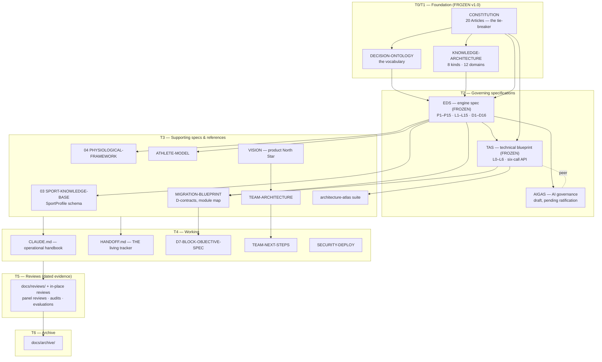

# Documentation Index

**Status: WORKING (living) · last full audit 2026-07-09**
The master map of every governed document: what it is, what it owns, and what it
depends on. Classes and rules: [`DOCUMENTATION-GOVERNANCE.md`](DOCUMENTATION-GOVERNANCE.md).
If a document isn't listed here, it isn't governed — add it or archive it.

## Dependency map (precedence flows downward)

Implementation sits below T3 and validates upward; reviews observe everything and
feed the archive. Full precedence rules: governance doc §1.

## T0–T2 · Canonical (the frozen set + AIGAS)

| Document | Purpose | Owns (canonical for) | Depends on | Related |
|---|---|---|---|---|
| [`foundation/CONSTITUTION.md`](foundation/CONSTITUTION.md) | The 20 immutable Articles; ultimate tie-breaker; conflict-resolution order | Platform principles; safety/privacy floor (Arts 8–16 never weakened); amendment process | — | Ontology, KA, EDS (its Appendix A maps them) |
| [`foundation/DECISION-ONTOLOGY.md`](foundation/DECISION-ONTOLOGY.md) | Every entity defined once: reasoning spine, containment, diagnostic triangle, 7 entity families | The vocabulary — all naming/modelling | Constitution | KA, EDS §6 (defers here) |
| [`foundation/KNOWLEDGE-ARCHITECTURE.md`](foundation/KNOWLEDGE-ARCHITECTURE.md) | Knowledge separate from reasoning: 8 kinds of work, 12 knowledge domains, entry shape, governance | How knowledge/data are structured, owned, versioned | Constitution, Ontology | EDS Part VII implements it |
| [`engine/00-ENGINE-DESIGN-SPECIFICATION.md`](engine/00-ENGINE-DESIGN-SPECIFICATION.md) | How the platform reasons: P1–P15, L1–L15, the D1–D16 decision catalogue, three loops, domain models, validation | The engine's decision architecture | Constitution, Ontology, KA | engine 01–05 (subordinate companions) |
| [`architecture/TAS.md`](architecture/TAS.md) | How software is built to honour the above: L0–L6 layers, module catalogue, six-call engine API, data lifecycle, two learning systems | The technical architecture | All four above | AIGAS (peer), MIGRATION-BLUEPRINT (derived plan) |
| [`architecture/AIGAS.md`](architecture/AIGAS.md) | What AI may be: four verbs, two seams, C1–C9 capability taxonomy, 8 prohibitions, trust/ops rules | The AI/engine boundary | All governing docs | AIGAS-REVIEW (ratification evidence) · **pending panel + ratification** |

## T3 · Supporting

| Document | Purpose / owns | Notes |
|---|---|---|
| [`engine/03-SPORT-KNOWLEDGE-BASE.md`](engine/03-SPORT-KNOWLEDGE-BASE.md) | **Canonical schema** for the 21-section `SportProfile`; authoring rules; privacy validator | Status paragraphs historical (SKB is now the sole sport source — 11 profiles, season-phased) |
| [`engine/04-PHYSIOLOGICAL-FRAMEWORK.md`](engine/04-PHYSIOLOGICAL-FRAMEWORK.md) | **Canonical** metrics model: raw schema → baselines → 9 indices → decision bands | Current and path-accurate |
| [`engine/01-PANEL-REVIEW.md`](engine/01-PANEL-REVIEW.md) | The graded evidence base (L1–L5) the EDS's laws cite | Architecture half historical; read the banner |
| [`architecture/MIGRATION-BLUEPRINT.md`](architecture/MIGRATION-BLUEPRINT.md) | D1–D16 contracts in build form; decision ownership; target module map | Backlog (Sprints 0–12) essentially executed; remaining: D16 promotion, endurance programming |
| [`architecture/ATHLETE-MODEL.md`](architecture/ATHLETE-MODEL.md) | Implementation reference: athlete model, capability estimation, diagnosis (D4/D5), D9–D11 | Living; cohort-scope statements updated 2026-07-09 |
| [`product/TEAM-ARCHITECTURE.md`](product/TEAM-ARCHITECTURE.md) | Team package blueprint; the binding data-isolation / RLS pattern | Built and live on prod (banner updated 2026-07-09) |
| [`strategy/VISION.md`](strategy/VISION.md) | **Canonical product direction** — mission, two packages, principles | Evergreen |
| [`architecture-atlas/`](architecture-atlas/README.md) | Founder-facing suite: Atlas, Decision Register (ADRs), Data Dictionary, Flow Map (+ Health Report → REVIEW) | Refreshed + committed 2026-07-09; snapshot-dated |
| [`SCHEMA.md`](SCHEMA.md) | Human-readable data model | ⚠ STALE — 12 of 19 tables; reconcile queued (open queue #8); Data Dictionary currently more accurate |
| [`SECURITY-AUDIT.md`](SECURITY-AUDIT.md) | Security audit (2026-06-21) + live S1–S15 addendum | Pairs with `supabase/SECURITY-DEPLOY.md` |
| Root/`apps/*`/`packages/*` READMEs, [`setup/sign-in-with-apple.md`](setup/sign-in-with-apple.md), `supabase/OAUTH-SETUP.md` | Package-local and operational references | OAuth pair overlaps — merge queued |
| [`supabase/migrations/README.md`](../supabase/migrations/README.md) | **Canonical migration ledger** + DB-change discipline | Every schema change lands here |

## T4 · Working (living trackers)

| Document | Role |
|---|---|
| [`../CLAUDE.md`](../CLAUDE.md) | The operational handbook every session loads — philosophy, precedence, hard rules, session protocol |
| [`../HANDOFF.md`](../HANDOFF.md) | **The single living status tracker**: current state + open queue. History → archive |
| [`DEVELOPMENT-PLAN.md`](DEVELOPMENT-PLAN.md) | **The roadmap-of-record** (2026-07-13): composes the four audit/design inputs into phases 0–4 → Decision Engine V2 + the Data & Analytics product. Owns the ORDER; HANDOFF owns the status |
| [`AMENDMENT-QUEUE.md`](AMENDMENT-QUEUE.md) | **The amendment queue's single home**: lifecycle register (QUEUED→BATCHED→RATIFIED/REJECTED) for frozen-set/T2 amendment candidates. Evidence stays in reviews; process rules in governance doc §3 |
| [`architecture/D7-BLOCK-OBJECTIVE-SPEC.md`](architecture/D7-BLOCK-OBJECTIVE-SPEC.md) | Live design spec; §9 open questions gate D7 broad activation + D6 |
| [`engine/05-INDEX-LAYER-FOLLOWUPS.md`](engine/05-INDEX-LAYER-FOLLOWUPS.md) | Deferred index-layer specs; Spec B (integrator re-weighting) still open |
| [`product/TEAM-NEXT-STEPS.md`](product/TEAM-NEXT-STEPS.md) | Team package tracker (schedule→constraints is next) |
| [`../supabase/SECURITY-DEPLOY.md`](../supabase/SECURITY-DEPLOY.md) | Ordered prod-deploy checklist; pending edge-function deploys |

## T5 · Reviews — see [`reviews/README.md`](reviews/README.md)

Dated evidence, never current state. In `docs/reviews/`: STATE-OF-THE-APP
(2026-07-07), the documentation audit (2026-07-09), the governance-sprint phase
reviews (2026-07-09), the Sprint 2 engine forensic audit
(`2026-07-11-engine-audit-01…10`), and the governance forensic audit
(`2026-07-11-governance-audit-00…09` — the frozen set judged against a
world-class end-state benchmark; 92-finding register + amendment queue in
deliverable 09). In place (frozen/code references): `decision-engine-evaluation.md`,
`engine/01`, `engine/06–08`, `architecture/REASSESSMENT-2026-07-05.md`,
`architecture/AIGAS-REVIEW-2026-07-06.md`, `foundation/PANEL-REVIEW.md`,
`SECURITY-AUDIT.md` (June body).

## T6 · Archive — see [`archive/README.md`](archive/README.md)

BASELINE-ARCHITECTURE-ASSESSMENT · PHASE3-ARCHITECTURAL-AUDIT · STAGE2-GUIDE ·
STAGE3-RUNBOOK · HANDOFF-HISTORY-2026-06--2026-07 · (in place, banner:
`engine/02-REFACTOR-ROADMAP.md`).

## Immutable sprint records

[`superpowers/`](superpowers/README.md) — 47 specs + 33 plans, one per shipped
sprint/WP (all merged; verified 2026-07-09). Immutable after merge. The
athlete-model design spec is additionally cited by CLAUDE.md as the design
record for a live subsystem.

## Five-minute orientation for a new reader

1. `CLAUDE.md` — how to work here (5 min).
2. `HANDOFF.md` — where things stand (5 min).
3. `architecture-atlas/01-ARCHITECTURE-ATLAS.md` — what the platform is, in plain English.
4. `foundation/CONSTITUTION.md` — why, at the deepest level.
5. Going deeper: EDS for engine reasoning · TAS for software shape · this index for everything else.
