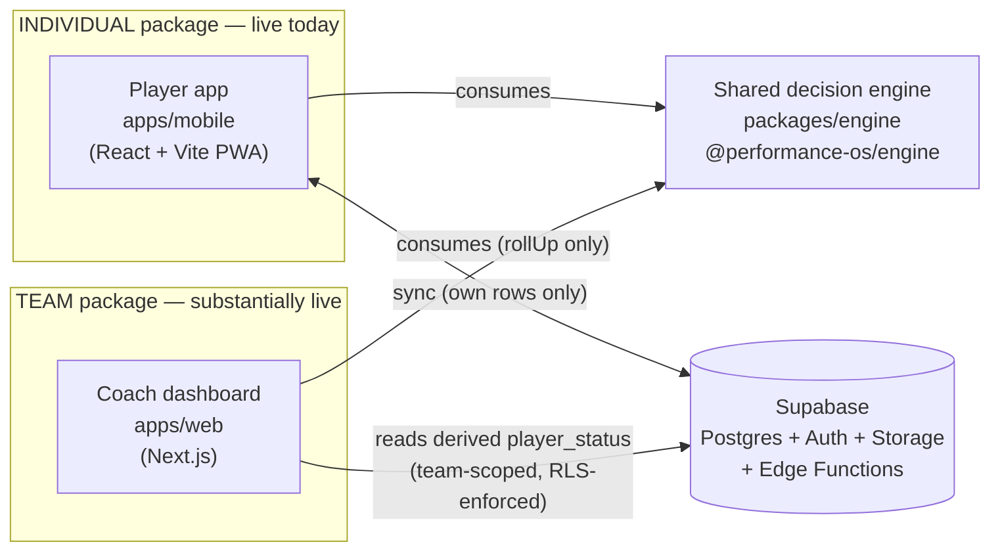
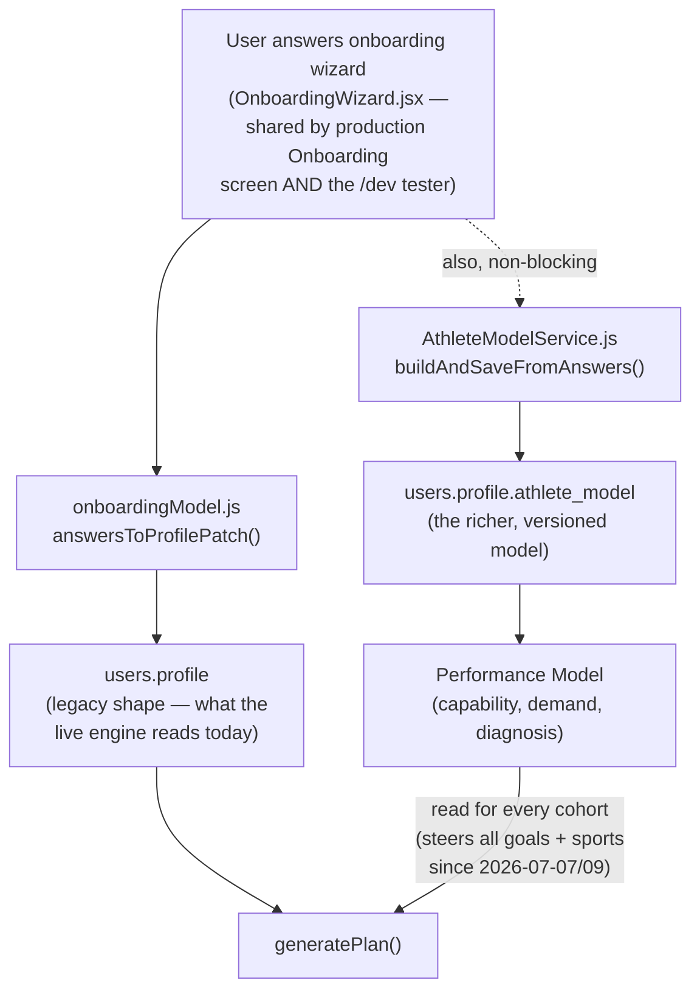
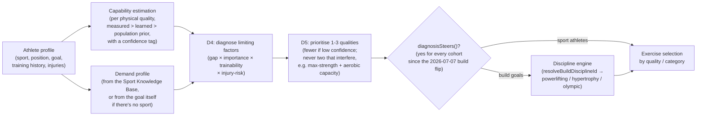
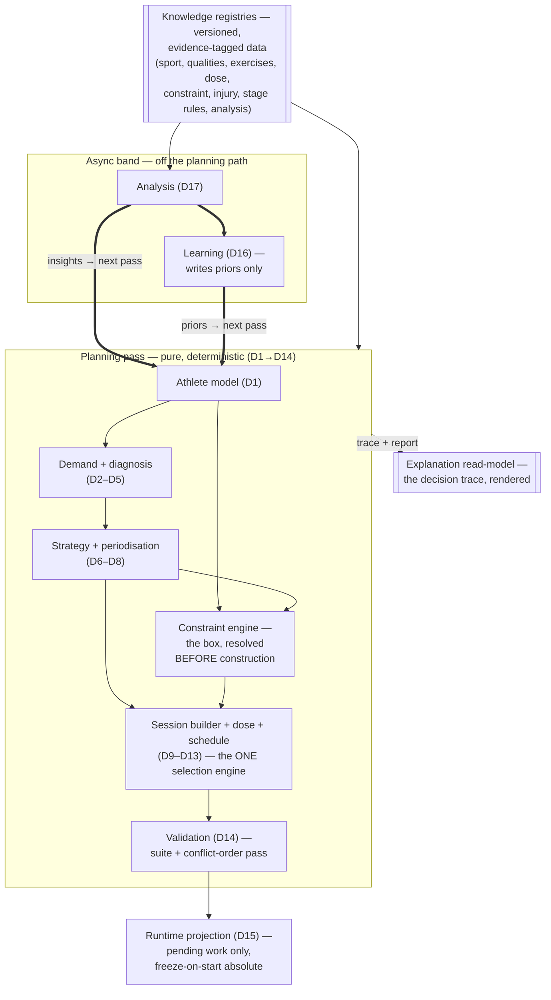
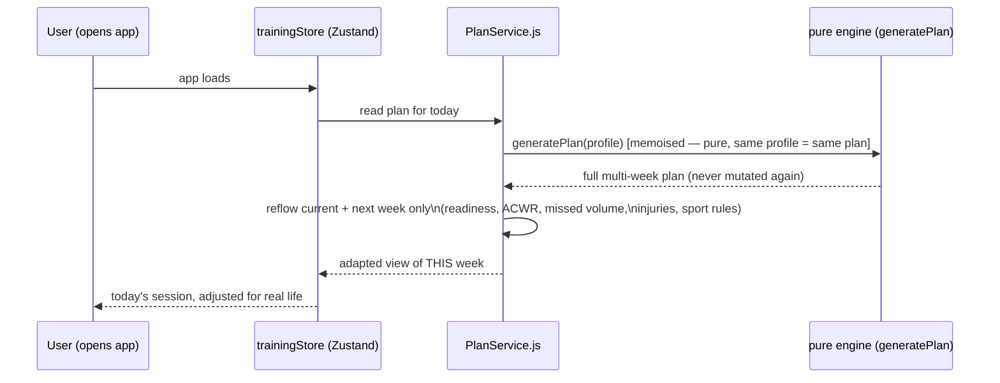
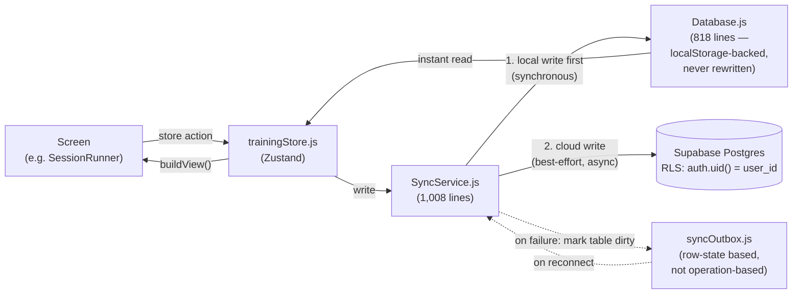
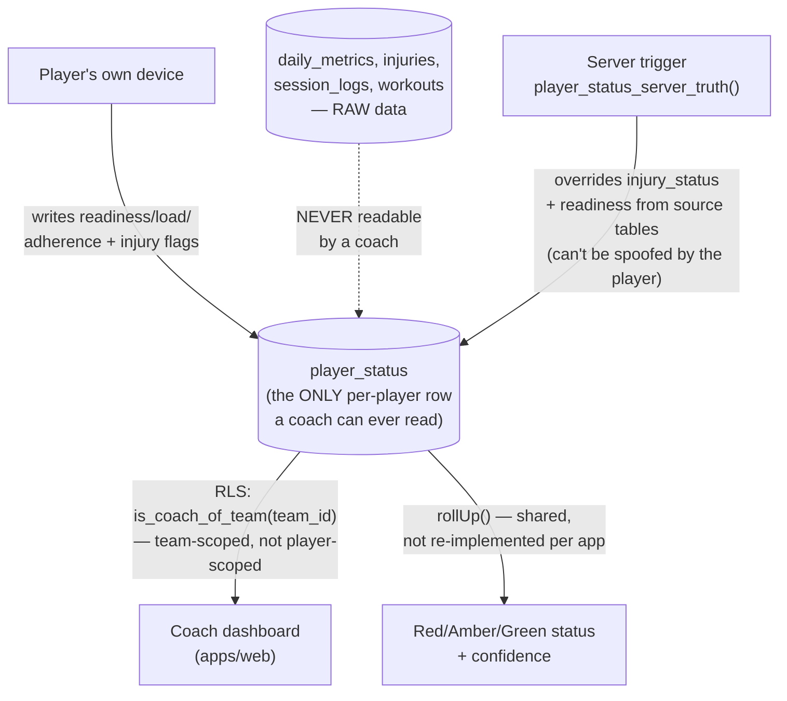

# Architecture Atlas

**Performance OS — the master architectural map**
Audience: the founder. Written to be read without opening a single source file.
Status: living document, generated from a full-repository read on 2026-07-06. Not one of the five frozen governance documents — it *describes* the system those documents govern.

---

## How to read this document

Performance OS is not one app — it is a small number of **capabilities** (things the platform knows how to do) implemented across several codebases that all share one brain. This document walks through those capabilities one at a time. For each one you'll get:

- **What it is** — in plain English
- **Why it exists** — the problem it solves
- **How it works** — just enough mechanism to reason about it
- **Inputs / outputs** — what flows in, what flows out
- **Who depends on it, and who it depends on**
- **Where it lives** — the real files, so an engineer can jump straight in
- **Who owns it, how often it changes, and what a typical change looks like**
- **Why it matters architecturally** — what would break, or what risk exists, if this piece disappeared or was done badly

The capabilities are ordered roughly the way information actually flows through the platform: a person signs up → the platform builds a model of them → it diagnoses what they need → it builds a plan → the plan runs day-to-day and adapts to real life → it syncs to the cloud → a coach (for the Team package) sees a privacy-safe summary. Governance, knowledge, and cross-cutting concerns (testing, security) are covered at the end.

---

## 0. The one-paragraph version *(refreshed 2026-07-09)*

Performance OS takes a short questionnaire and turns it into a multi-week strength training programme, tailored to what the person is actually trying to achieve — get stronger, build muscle, move well, or support a sport they already play. The programme adapts week to week around what the person actually did, how recovered they are, and any injuries. All of this is computed by one deterministic "engine" — a pure function that always gives the same answer to the same question — which today lives in its own shared code package so it can be reused by a coach-facing web dashboard as well as the phone app. The whole thing runs on a phone-first web app (a PWA) with Supabase (a hosted Postgres database + authentication service) as the backend. A deliberate, incremental rebuild ("the engine re-seating") changed *how the engine reasons* — from "fill a volume target" to "diagnose what's limiting the athlete, then prescribe for that" — without a rewrite, and that migration **completed**: since 2026-07-07 (build goals, via the discipline engine) and 2026-07-09 (the SKB consolidation), the engine is diagnosis-first end-to-end for every goal and every sport.

---

## 1. Platform overview: the two packages

**What it is.** Two customer-facing products sharing one brain:

1. **Individual** — a person answers an onboarding questionnaire on their phone and gets their own tailored plan. This is the whole product today; it's mature, evidence-based, and has been running since Stage 3 of the roadmap.
2. **Team** — a coach's version. A coach runs a squad (a rugby team, a swim club, whatever), sets the team's fixed schedule (matches, pitch sessions), and gets a plain-English "who's overloaded, who's undertrained, who's injured" view — **without ever seeing any individual player's raw health data.** Each player still gets their own Individual-style plan; the coach's schedule just becomes a constraint on it.

**Why two packages, one engine.** The Product North Star (`docs/strategy/VISION.md`) is to open elite strength & conditioning to people and clubs who can't afford a real S&C coach. A club coach isn't an S&C specialist and can't be expected to read wearable data — they need the *same* deterministic coaching decisions the individual product makes, aggregated and privacy-filtered. Building a second coaching brain for teams would double the surface area for bugs and let the two products silently disagree (an early prototype of the coach dashboard did exactly this — hand-computed its own version of the coach-facing math in TypeScript before the team switched it to consume the shared engine's `rollUp()` function directly, deleting the duplicate — see the ADR).

**Current state (verified 2026-07-06, not the "not built yet" framing in older docs).** The Team package is **substantially live**, not a future stage:
- The `teams` / `team_members` / `player_status` data spine is live in production with Row-Level Security proven by an adversarial test harness.
- The coach dashboard (`apps/web`) reads real Supabase data through that RLS, gated by a real login + active-coach check — it is not showing mock data.
- The coach's schedule already constrains player plans (match days block/soften gym scheduling for the player).
- Marketing site pages (`/`, `/about`, `/pricing`, `/contact`, `/teams`, `/how-it-works`) are all real, content-driven pages.
- Genuinely not yet live: lead-capture delivery (currently a `console.log` / mailto fallback), analytics, and per-player load-trend history on the dashboard (always renders empty — honestly, not silently).

---

## 2. The governance layer (above all code)

**What it is.** Five documents, frozen at version 1.0 on 2026-07-01, that define the platform's philosophy and its target technical shape. They sit *above* the code — every feature is validated against them, not the reverse.

| Document | What it establishes |
|---|---|
| `docs/foundation/CONSTITUTION.md` | 20 non-negotiable Articles across 5 Titles (Purpose, Coaching Method, Safety, Evidence & Honesty, Architecture & Stewardship). The "ultimate tie-breaker" when anything conflicts. |
| `docs/foundation/DECISION-ONTOLOGY.md` | The canonical vocabulary — what an "Athlete," a "Limiting Factor," a "Demand Profile," a "Block" actually mean, and how they relate (the Reasoning Spine, the Containment Hierarchy, the Diagnostic Triangle). |
| `docs/foundation/KNOWLEDGE-ARCHITECTURE.md` | The rule that adding a sport/exercise/injury/philosophy must mean **adding data**, never editing engine logic — and the "8 kinds of stuff" classification (Knowledge, Decision Logic, Inference, Calculation, Stored Data, Derived Data, Assumption, Prediction) that keeps guesses from masquerading as facts. |
| `docs/engine/00-ENGINE-DESIGN-SPECIFICATION.md` (the EDS) | The engine-specific spec: the D1–D16 decision graph, and the central thesis that coaching should be **diagnosis-first** (reason in physical qualities), not **volume-first** (reason in muscle sets) — the transition the live engine completed with the 2026-07-07 build flip *(refreshed 2026-07-09)*. |
| `docs/architecture/TAS.md` | The six-layer technical architecture (Governance → Engine → Knowledge → Orchestration → Platform Services → Learning → Experience), the engine's minimal public API, and the "AI seam" — where AI is allowed to plug in later, and where it categorically is not. |

**Why it matters.** Constitution Article 20 ("simplicity is a feature... the governor on all the others") and the explicit "re-seating, not a rewrite" directive are what keep a solo-founder-scale project from trying to build all 16 D-decisions and 12 knowledge domains before shipping anything. The frozen set also carries its own self-critique built in (a six-lens Panel Review exercise was run against it before freezing), which is unusual rigor for a project this size.

**Living companions (not frozen, updated every session):** `docs/architecture/BASELINE-ARCHITECTURE-ASSESSMENT.md` (what exists today vs. the frozen target) and `docs/architecture/MIGRATION-BLUEPRINT.md` (the executable rebuild plan — waves W0–W11, an explicit D1–D16 catalogue, a sprint backlog). `HANDOFF.md` at the repo root is the running session-to-session log. This Atlas and its four sibling documents sit alongside those, describing current reality for a non-engineer reader.

---

## 3. Onboarding & the Athlete Model *(refreshed 2026-07-09)*

**What it is.** The questionnaire a new user completes, and the two parallel representations it produces: (1) the **legacy profile** (`users.profile`) that the live plan generator has always read, and (2) the newer, richer **Athlete Model** (`users.profile.athlete_model`) — training history, movement competency, injury history, goals with priority — being built out as the foundation for the diagnosis-first re-seat.

**Why two representations exist.** The team could not pause the product to rebuild the input model in one step. The Athlete Model is deliberately built as a **parallel, non-live** structure, proven byte-identical to the legacy path by a golden-master test (`apps/mobile/tests/athlete-adapter-golden-master.js`, 10 archetype profiles) before anything downstream is allowed to read it for real decisions.

**Key files:**
- `apps/mobile/src/components/OnboardingWizard.jsx` (585 lines) — the actual question wizard, shared by production onboarding and the internal `/dev` tester so the two "never drift."
- `apps/mobile/src/lib/onboardingModel.js` (246 lines) — pure mapping from answers → both profile shapes.
- `apps/mobile/src/lib/AthleteModelService.js` (128 lines) — persists/validates/upgrades the Athlete Model; also home to the first (staged, non-live) learning loop.
- `packages/engine/src/lib/athlete/` — the schema (`schema.js`), and a **field-justification gate** (`fieldRegistry.js`) that mechanically enforces "every stored field must name the coaching decision it serves" — a real, tested constraint, not just a design principle.

**Ownership / lifecycle.** Changes when a new onboarding question is needed, or when a field graduates from the legacy profile into the Athlete Model. High architectural importance: this is the single entry point for everything the rest of the platform reasons about, and the field-registry gate is the mechanism preventing unjustified data collection from creeping in.

---

## 4. The Decision Engine — four layers in one package

The engine (`packages/engine`, published internally as `@performance-os/engine`) is the single most important piece of intellectual property in the platform. It is a **pure function**: `generatePlan(profile)` always returns the same plan for the same profile — no database calls, no clock reads, no randomness. That purity is what makes ~90,000+ generated test plans possible, what lets a "golden master" test catch any accidental behaviour change, and what lets the SAME engine run on the phone, on the web dashboard, and (later) inside a server-side Edge Function.

The most important single fact for a founder to understand about the current state of the product: **the diagnosis-first architecture IS the engine.** Since the build flip (deployed 2026-07-07) and the SKB consolidation (PR #160, 2026-07-09), every cohort — build goals and all 11 sports — is steered by the diagnosis/discipline layer. The volume-first mechanics did not disappear: they survive as the **downstream fill/ledger machinery** (`allocateGym`, the MRV volume ledger) that the diagnosis-first paths invoke — no longer a competing decision-making strategy. That transition, and exactly how it landed per cohort, gets its own subsection before the layer-by-layer walkthrough. *(refreshed 2026-07-09)*

### 4.0 The central architectural fact: volume-first vs. diagnosis-first, and exactly who gets which *(refreshed 2026-07-09)*

The frozen governance set defines the *target* engine as **diagnosis-first**: figure out what's limiting the athlete (a specific physical quality — max strength, aerobic capacity, mobility, etc.), then prescribe the minimum effective work to fix that, with muscle-volume computed afterward purely as a safety ledger. The engine **inherited** a **volume-first** design: compute a weekly per-muscle set target, then fill it — described in the engine's own audit as "an excellent answer to the wrong question."

The rebuild ("the engine re-seating") was executed cohort by cohort rather than as a single flip — and it is now **complete for exercise selection and programming across every cohort**. As of 2026-07-09 (KSV 1.30.0), verified directly in code:

| Athlete cohort | Diagnosis computed? | Diagnosis actually steers the plan? | Mechanism |
|---|---|---|---|
| Run, Cycle (and the other endurance sports) | Yes | **Yes — live** | Rating-based: exercises are selected by which physical quality they develop, ranked by transfer-per-fatigue (D11 re-seat, shipped Sprint 8). All 11 sports are also **season-phased** (KSV 1.29.0) — season-window phase detection (first/last game dates) selects a per-phase programming block from the SKB |
| Swim, Hurling, Gaelic football, Field hockey, Soccer, Rugby | Yes | **Yes — live, via a different mechanism** | Category-coverage: the sport's own authored exercise-library categories (e.g. "upper-body pull," "rotational power") are covered directly, because the fixed 10-quality vocabulary can't express what these sports actually need (this is *why* the first attempt at diagnosis-driven swim programming failed — see the ADR). Season-phased like every other sport; the SKB is the **sole** source for all sport gym-support data (PR #160 — the legacy `sportGymSupport` tables are deleted, not a fallback) |
| Get stronger / Build muscle / General fitness ("build" goals) | Yes (a real diagnosis is computed via a goal-derived demand profile) | **Yes — live since 2026-07-07 (the build flip, KSV 1.17.0–1.20.0)** | The discipline engine: `resolveBuildDisciplineId` routes get-stronger→powerlifting, build-muscle/functional→hypertrophy, olympic→olympic (a first-class discipline, barbell-gated). The discipline supplies periodisation, day emphasis, and dose character end-to-end; the legacy volume-first build path is **retired** |
| Block LENGTH / periodisation structure (a separate decision from exercise selection) | Only for sport athletes with a **learned** (not merely assumed) recovery-rate prior | Gated, and — because no learned prior is written yet (the learning loop is staged, not live) — **effectively dormant in production today** (D16 promotion pending) | `blockDeloadSteers()` gate in `plan/blockObjective.js` |

**Why this matters for the founder:** the migration this table describes is finished for exercise selection and programming — the diagnosis/discipline layer now decides *what* every user trains, and the old volume-first core survives only as the fill/ledger machinery underneath it (§4.1). The one still-dormant row is the learned-prior gate on block length. This was a deliberate, sequenced, de-risked migration — the two-strategies "split-brained" state earlier drafts of this document described ended on 2026-07-07/09.

### 4.1 Layer: Programming Core (the mechanical fill layer invoked by the discipline/sport paths) *(refreshed 2026-07-09)*

**What it is.** The pipeline that takes a profile and produces a full multi-week plan: goal → training style → periodisation → weekly muscle-set targets → exercise selection → scheduling onto weekdays. Since the build flip this is no longer "the live default" that decides what anyone trains — the diagnosis/discipline layer (§4.2) makes those calls for every cohort, and this pipeline is the **mechanical fill and safety-ledger machinery** those paths invoke: it fills sessions, pays down volume deficits, and enforces the MRV ceiling under the direction of whichever discipline or sport path is steering.

**Pipeline, in order:**
1. `resolveProgram` (`strength/program.js`) — goal → training style, per-muscle emphasis, a volume scalar, an exercise-priority list.
2. `resolvePeriodization` (`plan/periodization.js`) — block length, phase split (base/build/peak), deload week placement.
3. `weeklyMuscleTargets` (`strength/targets.js`) — the MEV→MAV volume ramp per muscle group across the block (Minimum Effective Volume rising toward Maximum Adaptive Volume — Renaissance Periodisation / Israetel / Schoenfeld's dose-response framework).
4. `allocateGym` (`plan/allocator.js`, ~1,050 lines — the single largest and highest-risk file in the engine) — the greedy fill: pattern anchors, "pay down" the biggest volume deficits first, respect the weekly MRV (Maximum Recoverable Volume) ceiling, add supersets, assign rep/RPE scheme, write session titles/durations honestly.
5. `scheduler` (`plan/scheduler.js`) — lays sessions onto actual weekdays, respecting sport-day avoidance and spinal-load spacing (`plan/axial.js` — no more than 4 units of "spinal load" per session, no two heavy-spine days back to back).
6. `despine` (`plan/despine.js`) — a follow-up pass that lightens the day after a spine-heavy day.

**Why it exists.** This is the mature, exhaustively evaluated (a ~60,000-plan automated sweep on 2026-06-21) machinery that still ships inside every plan: a hard weekly MRV ceiling, a genuine event taper (holds intensity, cuts volume — not a generic deload), adaptive fatigue/ACWR-driven deloads, sport-specific session anchoring, and honest session durations/titles. It is real, evidence-annotated engineering, not a toy — preserved through the re-seat as the downstream fill/ledger, with the decision-making seat above it now occupied by the diagnosis layer.

**Inputs:** the profile (goal, sport, experience, equipment, availability, tracked lift 1RMs). **Outputs:** a full `Plan` object — phases → weeks → sessions → exercise items with sets/reps/RPE.

**Ownership.** The riskiest single file to touch is `plan/allocator.js` — its own architectural audit names its eventual decomposition as the single highest-complexity, highest-regression-risk step in the whole re-seat.

### 4.2 Layer: The Diagnosis (Athlete Model + Performance Model) *(refreshed 2026-07-09)*

**What it is.** The layer that answers "what does this specific athlete actually need, and why" — described in detail in §3 above and the Data Dictionary. The mechanism:

**Why it exists.** This is the mechanism that operationalises Constitution Article 5 ("diagnosis precedes prescription; reason in qualities, not muscles"). The 10 tracked physical qualities (max strength, hypertrophy, explosive strength, reactive strength, strength endurance, aerobic capacity, anaerobic capacity, mobility, stability, robustness) and the diagnostic formula are governed, evidence-tagged data (`packages/engine/src/data/qualities.js`, `capabilityPriors.js`, `regionQualityRisk.js`, `qualityCompatibility.js`), not hard-coded logic — consistent with the Knowledge Architecture rule.

**Key files:** `packages/engine/src/lib/performance/` (`estimation.js`, `diagnose.js`, `prioritise.js`, `derivePerformanceModel.js`, `demandProfile.js`, `forProfile.js`), `packages/engine/src/lib/sportKnowledge/` (the Sport Knowledge Base read interface), `packages/engine/src/lib/athlete/`.

**Downstream consumers today:** the plan generator (every cohort, per §4.0 — sport paths directly, build goals via the discipline engine), and — independently — two user-facing screens (`apps/mobile/src/screens/Atlas.jsx`, the radar-chart "your #1 limiting factor" view, and `BlockCheckin.jsx`) that show the diagnosis to the athlete as *insight*. Since the build flip, what the athlete sees on those screens and what steers their actual training are the same diagnosis for every cohort. *(refreshed 2026-07-09)*

### 4.3 Layer: Session Building (D9/D10 — objective and movement requirements)

**What it is.** Once a target quality is chosen for a session, this layer decides the session's single named *purpose* (D9 — e.g. "Develop max strength — lower body", with an intensity zone and a fatigue budget) and the *movement requirements* that purpose implies (D10 — which movement patterns, at what force-velocity, e.g. "hinge/squat, maximal-force") — **before any specific exercise is chosen**. Constraints (an injury-blocked pattern, a beginner's competency ceiling) are subtracted at this stage, not filtered out afterward, per Constitution Article 19 ("construction proposes, validation disposes" applied one level earlier — never propose what's already known to be illegal).

**Key files:** `packages/engine/src/lib/session/sessionObjective.js`, `movementRequirements.js`, `categoryCoverage.js` (the sport-specific "cover these library categories, not these quality targets" mechanism used by swim/team sports), `sessionSpecs.js` (assembles both per session).

**Status:** live for every cohort since the 2026-07-07 build flip (see §4.0). *(refreshed 2026-07-09)*

### 4.4 Layer: Validation (D14 — construction proposes, validation disposes)

**What it is.** An **independent, structurally separate** re-check of a fully-built week — proof that even if the allocator has a bug, or a future AI proposes a replacement week, the shipped plan still passes every safety and quality gate.

**The five validators that exist today:**
1. **MRV ceiling** (`validation/mrvValidator.js`) — did any muscle group exceed its safe weekly recoverable volume?
2. **Injury contraindication** (can veto) — does any shipped exercise conflict with an active injury?
3. **Duration honesty** (can trim) — does the stated session length match reality?
4. **Equipment availability** (can veto) — does the athlete actually have what's prescribed?
5. **Purpose coherence** (can veto/trim) — does a session labelled "Upper body" actually deliver mostly upper-body volume?

**The authority mechanism** (`knowledge/authority.js`) is the more important architectural idea here: every finding is capped by how solid the science behind it is. A validator can only **veto** if the underlying knowledge is tagged "gate"-level confidence; softer evidence can only **trim**; the weakest evidence can only be **reported** (shown in rationale, can corroborate another signal, never act alone). This is Constitution Article 13 ("confidence governs authority") enforced as code, not convention — and it's the exact mechanism that keeps the contested ACWR metric (see §4.6) from being able to force a hard deload on its own.

**Ownership.** Explicitly named by the platform's own architectural audit as its largest remaining structural gap relative to the frozen target (which specifies 16 conceptual validators; 5 concrete ones exist today) — see the Health Report.

### 4.5 Layer: The Injury System

**What it is.** Widely regarded internally as the model the *whole* engine should follow: a small amount of generic reasoning code (`injury/injuryFilter.js`, `injuryRules.js`) sitting over a large, structured knowledge base (`injury/profiles.js`, 325 lines covering 14 body regions) rather than injury-specific `if` statements.

**How it works, plain English:** if you report an active hamstring strain, the app checks every exercise name in your week against a phase-specific block-list for hamstrings (deadlifts, RDLs, Nordics, sprinting — the block-list shrinks as you move through the four recovery phases: Protect → Early Motion → Loading → Return to Sport). Severity overrides self-reported phase — a severity-4/5 injury forces the strictest "Protect" blocks regardless of what stage you claim to be at. Blocked exercises get substituted or, if more than 70% of a session is blocked and the injury is severe, the whole session becomes a dedicated rehab session. Once an injury is marked recovered, prevention/"prehab" exercises are quietly added to future sessions — no banner, just protective work.

**Also includes:** a lightweight clinical triage tool (`injury/symptomAssessment.js`) with genuine red-flag safety nets (bladder/bowel changes, numbness, sudden-onset-with-inability-to-bear-weight all redirect to "see a professional" rather than let the app guess).

**Known content gap:** 5 of the 14 covered body regions (elbow, wrist, cervical, quad, shin) have blocking rules but no rehab-exercise library content yet — those users get exercises blocked with no rehab substitute offered (see Health Report).

### 4.6 Layer: Recovery, Readiness & Training Load (the Indices)

**What it is.** The layer that turns raw daily data (sleep, HRV, resting heart rate, and how the athlete *says* they feel) into the numbers that actually adapt the plan day to day.

**The key evidence-based design decision, stated plainly:** the athlete's own 1–5 self-rating of energy/soreness/mood/stress is weighted **at least as heavily as** objective wearable data (a cited 2016 sports-medicine finding — Saw, Main & Gastin — that subjective wellness is a more sensitive early overtraining signal than HRV/resting HR alone). And the popular "ACWR" metric (this week's training load ÷ your rolling 4-week average) is deliberately **demoted**: the code's own comments cite contested literature (Impellizzeri, Lolli) showing the ratio is mathematically shaky, so it can nudge volume down modestly on its own but can never *force* a deload by itself — it can only corroborate a decision that other, more trusted signals are already making.

**Key files:** `packages/engine/src/lib/indices/` (`readinessIndex.js` — the top-level integrator; `contract.js` — the shared confidence model every index uses; `sleepIndex.js`, `wellnessIndex.js`, `cardiovascularRecoveryIndex.js`, `fatigueIndex.js`, `recoveryCapacityIndex.js`, `consistencyIndex.js`, `trainingLoadIndex.js`), `recovery/recovery.js`, `load/load.js`, `plan/trainingLoad.js` (the actual ACWR math — Edwards-TRIMP heart-rate-zone loading, 7-day acute / 28-day chronic exponentially-weighted averages), `plan/rollingVolume.js` (a 10-day *rolling* window for missed-volume catch-up, rather than a rigid Monday-reset week, with a hard ceiling so catch-up never becomes overtraining — anything beyond the ceiling is explicitly "forgiven," visibly, never silently dropped).

**Confidence, made concrete:** every index returns not just a value but a confidence score (input completeness × how reliable the data source is × how mature the athlete's personal baseline is) and a list of exactly which inputs were missing — so a low-data user gets an honestly low-confidence readiness number rather than a falsely precise one.

### 4.7 Knowledge Governance

**What it is.** The mechanism that makes "evidence-based" a structural property of the code, not a marketing claim. Every scientific constant the engine uses — volume landmarks, dose schemes, ACWR thresholds, recovery bands — is a `KnowledgeEntry` (`packages/engine/src/lib/knowledge/entries.js`, `kb.js`, `authority.js`, `schema.js`) carrying a citation, an evidence level (L1 meta-analysis → L5 expert opinion), a confidence rating, and a last-reviewed date. A schema validator refuses to load a malformed entry. `authority.js` turns confidence into a decision-facing tier (`gate` / `soft` / `reported`) that validators and load/recovery logic read directly — the "ACWR can't act alone" rule described above is this mechanism in action, not a special case.

**Why it matters.** This is the single clearest piece of evidence that the "evidence-based, honest about confidence" claim in the Vision document is actually implemented in code, not just asserted in marketing copy — a genuinely unusual level of engineering discipline for a project this size.

### 4.8 Decision Engine V2 (proposal) *(added 2026-07-14 — describes a design proposal, NOT the running engine)*

> **Boundary note.** Everything in §§4.0–4.7 above describes the engine as it runs today. This subsection is different in kind: it points at a **design proposal only**. A complete V2 design set exists at `docs/design/engine-v2/` (authored 2026-07-14, tier T4 working documents, **not adopted** — it becomes the blueprint only when Simon ratifies it via `docs/DEVELOPMENT-PLAN.md` §5.3, "Ratify the blueprint"). No element of the V2 design exists in code yet; nothing below is a description of current behaviour.

**What the proposal targets, in brief** (from the set's anchor, `00-ARCHITECTURE.md` §2). One pure, deterministic reasoning core — assessment, planning, validation, readiness, and recommendation are decisions inside it, not separate engines. The engine is an explicit, ordered graph of coaching decisions (the ratified D1→D17 catalogue), with sessions rendered *from* decisions, never assembled directly. Knowledge — including every magnitude and coefficient — is versioned, evidence-tagged data the core consumes, never contains. Constraints (time, equipment, injuries, calendar, readiness) resolve into one typed artefact *before* construction, so validation becomes the backstop it was always meant to be, not the primary defence. Construction proposes; an independent validator suite disposes, with the Constitution's conflict order compiled into an explicit resolution pass inside D14. Explanation is a read-model over the decision trace — assembled from the reasoning, never reconstructed after the fact. Analysis (D17) and learning (D16) run in an async band off the planning path: insights and priors flow forward-only into the *next* planning pass. Runtime adapts by projection over pending work only — the generated plan is immutable and a started session is frozen absolutely. And there is exactly ONE selection engine: the legacy volume-first fill is designed out entirely, its retirement a gated migration phase.

The proposed module graph, reduced to its spine (the full typed version is diagram 1 of `12-MODULE-DEPENDENCY-DIAGRAM.md`; like the original, this is a design artefact, non-normative):

**Where to read the proposal.** Start at the set's own index and status banner: [`docs/design/engine-v2/README.md`](../design/engine-v2/README.md) — it gives the reading order (anchor documents 00–02 first) and the rule the whole set obeys: every document is a proposal validated against the frozen governance set as amended (v1.1), with genuine divergences queued in an Amendment Register, never applied.

---

## 5. Adaptive Runtime — PlanService

**What it is.** The one file every screen reads plan content through (`apps/mobile/src/lib/PlanService.js`, 634 lines). It wraps the pure `generatePlan()` and layers three things on top: (1) memoised generation, (2) the **adaptive reflow** — reshaping only the current and next week around what actually happened, and (3) injury filtering.

**The reflow, precisely:** it recomputes only when something meaningful changes (today's date rolling forward, a session's completion state, the readiness band, an injury, a fired sport-rule) and can: force or defer a deload, spread missed volume across upcoming sessions (capped, never crammed), lighten a session that lands on a sport day, and leave a session **completely untouched** if nothing about it actually changed (a deliberate "baseline identity" rule so the reflow doesn't needlessly re-derive a session that was already fine). Every reshape is stamped with a visible reason (`deloadReason`, `_ruleTrim`, `_catchUp`) — Constitution Article 15's "no silent debt" rule, enforced in the data shape itself.

**"Freeze-on-start."** The moment a user taps Start on a session, its exact current content is pinned (`apps/mobile/src/lib/sessionOverrides.js`) — so the reflow can keep adapting future days without ever changing a workout that's already in progress. This mechanism has been fixed at least once in the past (a "pin-on-start" bug where a session could still be silently reshaped after starting) and is now covered by regression tests.

**Architectural note:** the true reflow *policy* has been extracted into the pure engine (`packages/engine/src/lib/plan/reflow.js`, 349 lines); `PlanService.js` itself is meant to hold **no mutable coaching state** — a genuine architectural improvement completed mid-2026, though the file's history (once 818+ lines of state and logic mixed together) is a reminder of how easily an "orchestration" layer can accumulate real decision logic if it isn't actively kept thin.

---

## 6. Learning Loop (staged, not live)

**What it is.** The very first piece of a genuine learning system: at the end of a training block, `learning/blockOutcome.js` treats the diagnosis as a falsifiable hypothesis and checks it against what actually happened — did the athlete's tracked lift numbers (1RM estimates) actually rise, did their self-rated recovery hold up or decline. If both signals corroborate a struggling block, it proposes exactly one conservative candidate ("reduce volume tolerance to 90%") — never an increase, always requiring two signals to agree.

**Why it is NOT live.** The candidate is written to `model.stagedPriors`, a field **nothing in the engine currently reads**. Promoting a staged value into `model.learnedPriors` (which the engine *does* read, for the one gated block-length decision described in §4.0) is a deliberate, human-reviewed step — described in the code itself as "the same twice-gated pattern as the AI seam." This is Constitution Article 18 in action: learning updates priors, never mutates a plan directly, and a human decides when the first learned behaviour goes live.

---

## 7. The AI Seam (built, deliberately switched off)

**What it is.** A carefully scoped boundary for where AI is — and is *not* — allowed to touch the platform, formalised in a sixth (not yet ratified into the frozen set) governance document, `docs/architecture/AIGAS.md`, reviewed and found aligned.

**The rule, one sentence:** the deterministic engine makes coaching decisions; AI may only **interpret** (turn free text into structured data), **communicate** (turn structured output into plain-English prose), **analyse** (surface patterns for a human), or **augment** (propose an alternative for one specific, contract-bounded decision — always re-validated by the same deterministic gates every other path must pass). AI never makes a safety call, never bypasses a validator, never grades its own confidence.

**What's actually built today, verified in code:**
- `packages/engine/src/lib/ai/contracts.js` — the substitution-contract mechanism (currently declared only for D11, exercise selection); a proposal is rejected outright on any trim-or-worse finding.
- `apps/mobile/src/lib/AiService.js` — a genuinely careful client-side seam: a hard kill-switch (`profile.ai_features === true`, default **off**), an explicit denylist of raw-vital fields that must never reach an AI artefact, and a call to a server-side Supabase Edge Function (`ai-render`) that itself has three independent guards (a kill switch, JWT auth, and a recursive "does this artefact contain a raw-vital key" leak gate) before it will call the Anthropic API. **Nothing in the current codebase references `AiService.js` from any screen** — the plumbing is real and tested in isolation, but not yet wired to a UI.
- The Anthropic API key lives only inside the server-side Edge Function's environment — never in the browser, satisfying the platform's hardest rule about AI.

**Status:** correctly described as "placeholder" from a user's point of view (no AI feature is reachable today), but this significantly understates how much real, careful engineering already exists behind the placeholder.

---

## 8. Data & Sync Layer

**What it is.** The three-file stack that gives the app its offline-first feel: `Database.js` (a synchronous, localStorage-backed mini-database — every table, generic CRUD, soft deletes), `SyncService.js` (writes locally first, then attempts Supabase, logging and queuing on failure rather than blocking), and `syncOutbox.js` (remembers *which tables* have unsynced changes, not individual operations, so it's idempotent and immune to ordering bugs).

**Why it exists.** CLAUDE.md's own hard rule — "don't rewrite Database.js, other code depends on its synchronous API" — exists because the whole UI assumes reads are instant. This is a deliberate trade-off: durability and offline resilience over strict cloud-first consistency.

**Traced example (verified in code):** completing a session validates the payload (`validation/validate.js`), writes to `Database.js` synchronously (this is the moment the write is durable on-device), then fires an unawaited Supabase upsert; any failure just marks the tables dirty for the outbox to retry on the next `online` event. The cloud always converges to "whatever the phone currently believes," never a stale queued payload.

**Storage isolation.** `Storage.js` namespaces every localStorage key by the signed-in account's UID, so two people sharing a device never see each other's cached data — a real, tested privacy mechanism, not an assumption.

---

## 9. Mobile App (the Individual package's surface)

**What it is.** ~30 screens organised into six user journeys: Onboarding & plan creation, Daily session execution (Home → WeekDetail → SessionDetail → SessionRunner), Recovery & wearables (Health hub → Sleep/Recovery/Fitness-age/Training-load/Trends detail screens, Integrations), Injury management (its own substantial feature, `Injuries.jsx`, 711 lines), Coach/Team (Teams.jsx — join a team by code), and Account/settings.

**Design system.** A single dark "Midnight" stylesheet (`styles/main.css`) with a fixed set of real theme variables (`--bg-surface`, `--txt-strong`, `--rust`, `--moss`, `--ochre`, etc.) — CLAUDE.md specifically warns against three invented variable names that have caused visible colour bugs three times in the past; a full repo-wide check during this documentation sprint found **zero instances** of those specific invented variables today, though a few screens do use raw hex colours that duplicate an existing theme variable (see Health Report).

**Shared shell:** `TopBar` / `TabBar` / `ScreenContainer`, always wrapping every route; `components/ui/` holds small, clean, well-reused presentational primitives (rings, sparklines, a radar chart, an info-tooltip).

**State:** two Zustand stores. `trainingStore.js` (579 lines) is the central nervous system — its `buildView()` function re-derives the entire app's view model (session states, readiness, load, recovery) from localStorage on every relevant change, and is the exact mechanism that makes reads instant. `authStore.js` (277 lines) handles only the Supabase session and per-user cache namespacing — it never touches training data.

---

## 10. Team Package: the data-isolation spine

**What it is.** The mechanism that lets a coach see "is this player okay" without ever seeing *why* in clinical detail. `player_status` is the **only** table a coach can query per-player, and it holds exactly six coach-safe fields: readiness (a number), load_state, ACWR, adherence percentage, injury status (available/modified/out), and display name. Two of those fields — the two a coach might actually act on — are **server-derived by a Postgres trigger**, not trusted from the player's own client, closing off a real spoofing risk (a player claiming "available" while actually red-flagged).

**How the isolation is enforced (three independent layers, not one):**
1. Every existing per-user table gets **zero new policies** from the Team package — the generic `auth.uid() = user_id` rule stands untouched.
2. `player_status` read access uses `is_coach_of_team(team_id)` (team-scoped) — this was originally `is_coach_of(user_id)` (player-scoped, letting a multi-team player's status leak across teams), a real bug caught and fixed within about 24 hours by the team's own review process.
3. The RAG-status math (`rollUp()`) lives once, in the shared engine package, consumed identically by the phone app's own team-status push and the coach dashboard's read — so the two surfaces cannot silently disagree.

**Verified live:** 19 database tables including the full team spine, 21+ RLS policies, an adversarial test harness proving the isolation both ways ("a player cannot read a teammate's status," "the coach reads zero raw vitals").

---

## 11. Coach Web Dashboard + Marketing Site (`apps/web`)

**What it is.** A Next.js application with two cleanly separated halves behind one route structure: the public marketing site (real, content-driven, no functional gaps) and the coach dashboard (`/dashboard/*` — Home, Focus, Squad, Constraints views), gated by a real server-side security check (`proxy.ts` — Next 16's replacement for `middleware.ts`) that verifies both a valid session and an active coach role before allowing access.

**Verified genuinely real, not mock:** every dashboard query goes through Supabase RLS; the dashboard's core RAG/confidence math is the shared engine's `rollUp()`, not a reimplementation (an earlier duplicate was deleted in favour of this on 2026-07-06, the same day this documentation sprint ran).

**Honestly-labelled gaps (the code says so itself):** team load-trend history and per-player readiness/load trend charts always render empty (no history feed built yet); lead-capture form submissions fall back to a `mailto:` link or a `console.log` (no persistence or email delivery wired); a "live demo" link in the marketing copy has no actual demo account behind it (would hit the real login wall).

---

## 12. Backend: Supabase

**What it is.** One shared Postgres database + Auth + Storage + six Edge Functions, serving both apps. 19 tables, 21+ RLS policies, 23 migrations tracking roughly five weeks of evolution.

**The data sensitivity model, at a glance:**

| Sensitivity | Tables | Coach-visible? |
|---|---|---|
| Raw vitals | `daily_metrics`, `wearable_readings`, `session_logs` (HR data), `weekly_checkins` | **Never** |
| Private structured detail | `injuries` (clinical triage fields), `users.profile` (Athlete Model) | **Never** directly |
| Derived, coach-safe | `player_status` | Yes — team-scoped only |
| Team metadata | `teams`, `team_members` | Roster: yes (to that team's coach). `join_code`: coach only, via a dedicated RPC — not a plain column read |
| Credentials | `wearable_connections` (OAuth tokens) | Owner can see connection status; **tokens themselves are excluded from the browser's column grant**, even for the owner |
| Security primitives | `oauth_states` | No client role can read this table at all — two SECURITY DEFINER RPCs only |

**Edge Functions:** `fitbit-auth-callback` / `fitbit-sync` / `enrich-sessions` (actually a Google Health API integration — the naming is a historical carry-over from an earlier Fitbit-only integration), `strava-auth-callback` / `strava-sync`, and `ai-render` (the one live AI-adjacent function, kill-switched off by default).

**Security posture.** A formal audit (2026-06-21, score 71/100 at the time) plus a 2026-07-05 multi-user addendum found and fixed several real issues in short order — an OAuth `state`-parameter impersonation vulnerability (public callback trusted a client-supplied value as identity — fixed with a signed, single-use nonce table), wearable OAuth tokens readable by the owning browser (fixed via column-level grant revocation), and the `player_status` team-scoping bug described in §10. This is covered in detail in the Health Report and the ADR.

---

## 13. Cross-cutting: testing & determinism

**What it is.** ~141 test files under `apps/mobile/tests/`, covering both the app-integration layer and (via the same runner) the engine package — plus a `run-all.mjs` runner and four golden-master JSON snapshots (`build-parity.json`, `engine-golden-master.json`, `injury-classification.json`, `knowledge-set-manifest.json`).

**Why it matters disproportionately.** The engine's purity guarantee is only as good as the tests that catch a violation. `npm test` was discovered to be **silently broken** (pointing at a deleted file) for an unknown period before being fixed as the deliberate first step ("Sprint 0") of the re-seating programme — precisely because, in the team's own words, there was no automated protection until then. Test count has climbed steadily and visibly through every risky change since (from 42 to 165+ passing tests across the re-seat), which is itself a good leading indicator, but the earlier gap is a reminder of how much a small team can accidentally lose without a CI gate.

---

## Summary table: architectural importance at a glance

| Capability | Architectural importance | Why |
|---|---|---|
| Pure engine core (§4.1) | **Critical** | The entire product's trust model rests on determinism + testability |
| Diagnosis layer (§4.2) | **Critical — live end-to-end** | The platform's actual coaching-quality differentiator; steering every cohort since 2026-07-07/09 *(refreshed 2026-07-09)* |
| Validation layer (§4.4) | **High, incomplete** | The only structural backstop against a bad plan; fewer validators exist than the target design calls for |
| Knowledge governance (§4.7) | **High** | The mechanism that makes "evidence-based" real rather than asserted |
| PlanService / reflow (§5) | **High** | Where "the plan reacts to real life" actually happens; historically prone to accumulating logic it shouldn't hold |
| Team data isolation (§10) | **Critical for Team package trust** | A single RLS mistake here is a privacy incident, not a bug — and one real gap has already occurred and been fixed |
| Sync/offline layer (§8) | **High** | Determines whether the app feels reliable; the "never rewrite Database.js" rule protects a lot of dependent code |
| AI seam (§7) | **Low today, high later** | Correctly inert now; the seam's design quality determines how safely AI can be turned on later |
