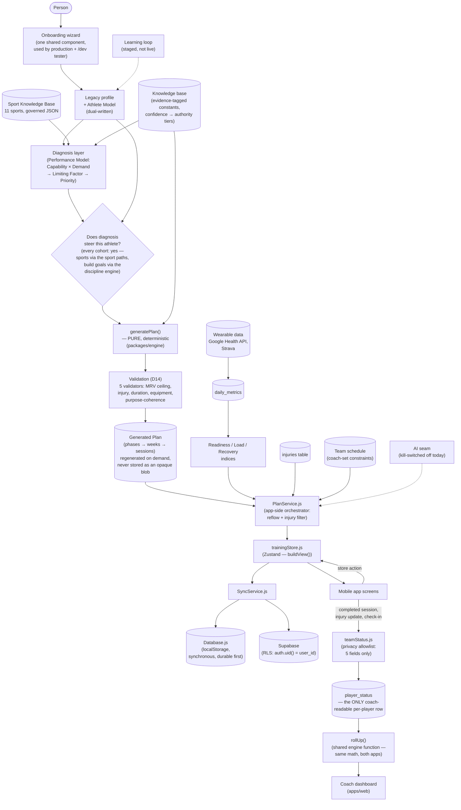
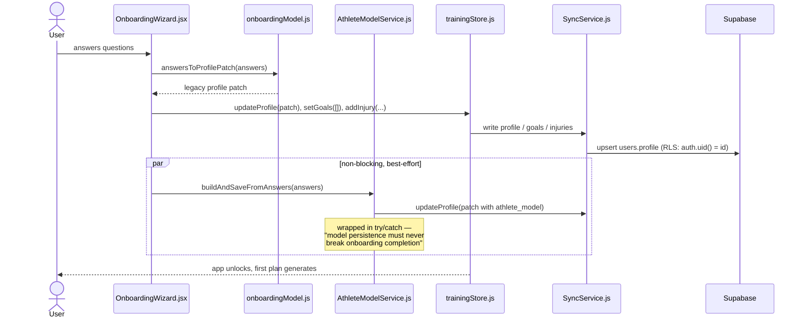
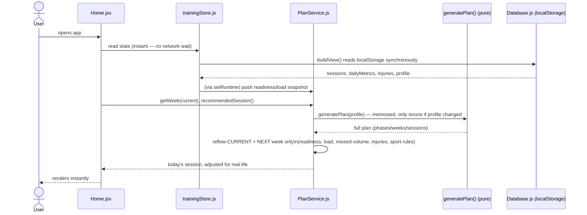
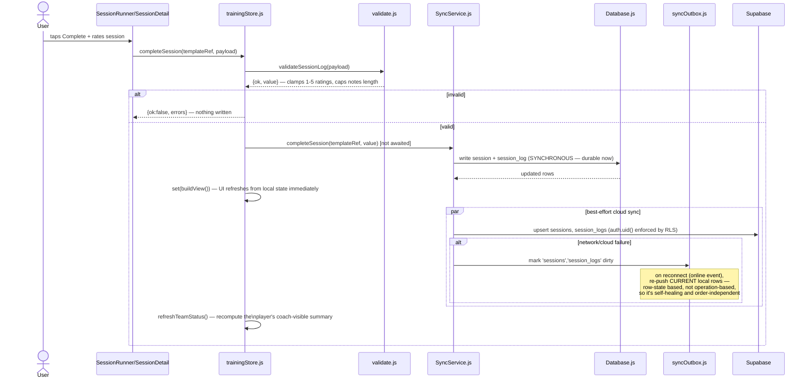
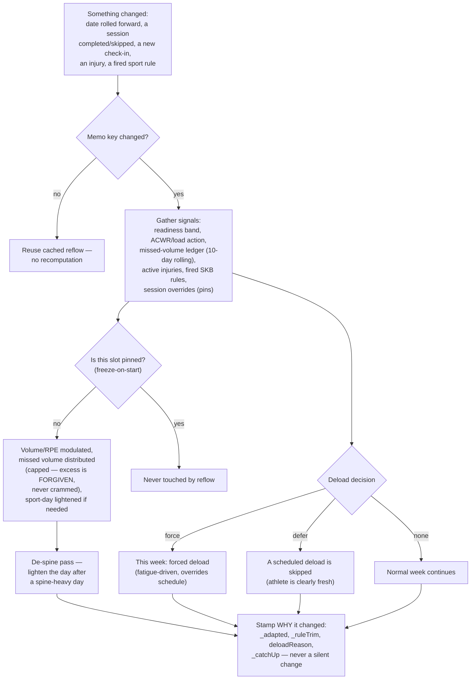
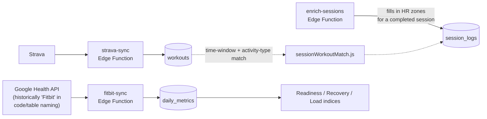
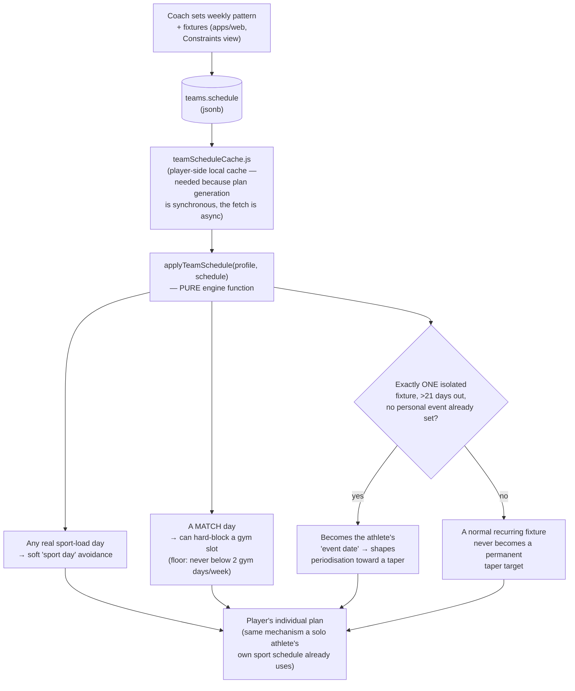
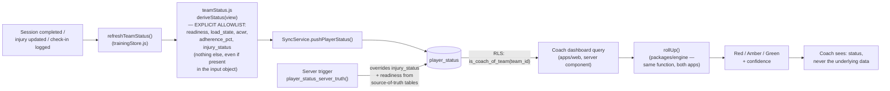
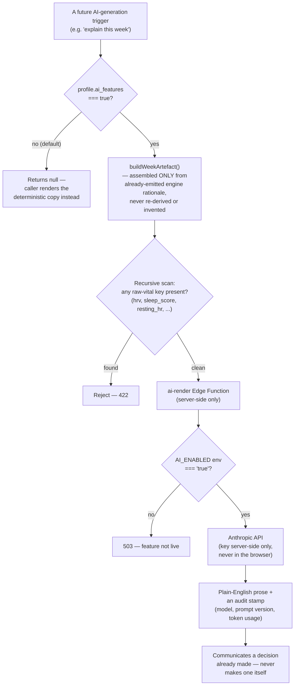

# Dependency & Information Flow Map

**Performance OS — how information actually moves through the platform**
Audience: the founder. Each diagram is followed by a plain-English walkthrough: what comes in, what goes out, what decisions get made, what state changes, and what assumptions the flow depends on. Coupling and simplification opportunities are called out explicitly at the end.

---

## 1. The whole platform, end to end *(refreshed 2026-07-09)*

**Walkthrough.** A person's answers become two profile representations. Those, together with governed sport knowledge and scientific constants, feed a diagnosis (computed for everyone, and — since the 2026-07-07 build flip — *acted on* for all cohorts). The pure engine generates a full plan, independently re-validated before being considered "shipped." From there, an app-side orchestrator (`PlanService.js`) blends in everything that changes day to day — wearable-derived readiness, training load, injuries, a coach's team schedule — to produce what the athlete actually sees for the current week, without ever mutating the underlying generated plan. Every write goes through a local-first, then cloud, sync layer. For Team-package athletes, a narrow, privacy-filtered summary is separately pushed to a shared table a coach can read through Row-Level Security. The AI seam and the learning loop both exist as real, tested code paths that are currently switched off / not consumed — shown here as dotted lines to make clear they are built but dormant, not vaporware and not live.

---

## 2. Onboarding, in sequence

**What comes in.** Free-form onboarding answers (goal, sport, position, experience, equipment, availability, optional 1RMs).
**What goes out.** Two saved profile shapes; the athlete now has an unlocked app and a generated plan.
**Decisions made.** None yet at the coaching level — onboarding is pure data capture and mapping, not diagnosis (diagnosis happens the first time a plan is generated).
**State changes.** `users.profile` is created/updated; `users.profile.athlete_model` is created best-effort.
**Assumption worth naming.** The Athlete Model build is explicitly non-blocking — if it fails, onboarding still completes on the legacy path. This is a deliberate resilience choice, not an oversight.

---

## 3. Opening the app on a normal day (the read path)

**What comes in.** Whatever is already in localStorage (no network dependency for this path at all).
**What goes out.** A fully rendered Home screen, with zero loading spinners for the core view.
**Decisions made.** The reflow's deload/ease/nudge-up logic, missed-volume redistribution, sport-day lightening — all re-evaluated here, but only for the current/next week.
**State changes.** None from a read — this is why it can be instant.
**Assumption worth naming.** This entire path assumes `Database.js`'s synchronous API never changes shape — which is exactly why CLAUDE.md's hard rule forbids rewriting it.

---

## 4. Completing a session (the write path, traced exactly through the code)

**What comes in.** A rating (quality/energy/recovery, 1–5) and optional notes.
**What goes out.** A durable local record (instantly) and, best-effort, a synced cloud record.
**Decisions made.** Validation (reject clearly bad input before it's ever written); nothing coaching-related is decided here — that already happened when the session was generated/reflowed.
**State changes.** `sessions.status → completed`; a new `session_logs` row; the player's `player_status` roll-up is refreshed (if they're on a team).
**Assumption worth naming.** The write is intentionally never blocked on the network — the comment in the code states this design goal explicitly ("never block completion on network"). This means a cloud failure is silent to the user by design; they are trusted to have their data safely on-device regardless.

---

## 5. The adaptive reflow loop (why "today's plan" can differ from "the plan you were first shown")

**What comes in.** The base generated plan (never itself touched) plus every real-world signal since it was generated.
**What goes out.** An adjusted view of the current + next week only; every future week is untouched until it becomes current.
**Decisions made.** Force/defer a deload; scale volume and target RPE; redistribute missed volume (bounded); lighten a session for a sport commitment.
**State changes.** None persisted directly by the reflow itself — it's a pure, re-derivable function of current state; what IS persisted is the underlying data it reads (session completions, injuries, check-ins) and, once a session is started, its frozen snapshot.
**Assumption worth naming.** The reflow explicitly never recomputes anything for a session the athlete has already started — this is the freeze-on-start mechanism, and it's the single most important trust guarantee in this whole loop (a workout in progress cannot change under you).

---

## 6. Wearable data ingestion

**What comes in.** Raw provider payloads (sleep stages, HRV, resting HR, activity summaries).
**What goes out.** Structured `daily_metrics` rows and `workouts` rows; enriched `session_logs` (average/max HR, HR-zone minutes) once a workout is matched to a planned session.
**Decisions made.** None coaching-related here — this layer is purely data normalisation ("an anti-corruption layer," in the platform's own architectural language).
**Assumption worth naming.** Only the device marked "primary" supplies baseline recovery metrics (HRV/resting HR/sleep); a secondary device (e.g. Strava, workouts-only) never overrides that — an explicit, tested rule preventing conflicting readings from two devices.

---

## 7. Team schedule → player plan constraint

**What comes in.** A coach's weekly training pattern and fixture list.
**What goes out.** A modified profile (same shape the pure engine already understands) fed straight back into ordinary plan generation — no new engine machinery, deliberately reusing the exact mechanism a solo athlete's own sport-day picker already uses.
**Decisions made.** How hard to constrain gym scheduling around a given day; whether an upcoming fixture is significant enough to become a taper target.
**Assumption worth naming.** The "isolated event" gate specifically guards against a weekly league fixture accidentally becoming a permanent taper target for every player, every week — a genuine, deliberately-designed safeguard, not an edge case someone forgot.

---

## 8. Player status roll-up → coach dashboard

**What comes in.** The player's own already-derived, already-privacy-filtered snapshot.
**What goes out.** A traffic-light status a coach can act on.
**Decisions made.** Severity scoring (how many "bad signal" points accumulate before a player shows red vs. amber); confidence (stale data, beyond 7 days old, is always downgraded regardless of what the signal says).
**Assumption worth naming.** The client proposes; the server disposes — for the two fields a coach might actually act on (injury availability, readiness), the client's write is always overwritten by a server-computed value from the real source tables, specifically so a player cannot spoof their own availability to a coach.

---

## 9. The AI seam (currently dormant, shown for completeness)

**Why shown even though dormant.** This is a case where "not live" does not mean "not built" — three independent kill switches and a real privacy leak-gate already exist and are tested, ahead of any user-facing AI capability actually shipping. Worth the founder knowing this distinction precisely, since it changes what "turning AI on" would actually require (flipping flags and wiring a UI, not building the safety mechanism from scratch).

---

## Circular dependencies, coupling, and simplification opportunities *(refreshed 2026-07-09)*

**No genuine circular dependency was found** in the engine package itself — the public API barrel (`packages/engine/index.js`) and a "deep-import ratchet" test specifically prevent internal modules from being imported directly by app code, which structurally forecloses most circular-dependency risk between the engine and its consumers.

**Coupling worth naming (not necessarily bad, but real):**

1. **`PlanService.js` ↔ the engine's `reflow.js`.** These two must agree on formulas like `weekTarget` — the code's own comments flag this explicitly as "must match the generator's formula," and the bulk of the actual reflow policy has since been moved into the engine package specifically to remove the duplication. A thin wrapper still exists app-side; worth confirming in a future pass that it stays a pure delegate and doesn't quietly regrow its own copy of the logic.
2. **Two exercise-selection mechanisms remain — by design.** The legacy volume-first fill was retired with the 2026-07-07 build flip (build goals now route through the discipline engine), so there is no longer a "for everyone else" default. What remains is a deliberate split between the two diagnosis-steered mechanisms: rating-based selection for the endurance sports (run/cycle etc.) and category-coverage for swim/team-sports (see ADR-05) — a recorded, evidence-grounded design decision, not migration residue.
3. **Three sport-vocabulary systems** coexist: the legacy engine's own sport strings (`run`/`cycle`/`swim`/`gaa`), the Sport Knowledge Base's canonical ids (`running_sprint`/`gaelic_football`/etc.), and onboarding's user-facing sport list. A binding table (`sportEngineBinding.js`) bridges them today; full reconciliation into one vocabulary is explicitly named as still-open work. PR #161 (2026-07-09) tightened the binding: onboarding's accepted-sport enum is now derived from `ENGINE_SPORT_IDS` (exported by the binding itself) rather than hand-copied, so the app-side list can no longer drift from what the engine accepts.
4. **The mobile app and the coach dashboard previously duplicated coaching-derivation logic** (the dashboard's own `lib/derive.ts`-style port). This was found and eliminated on 2026-07-06 by switching the dashboard to consume the engine's shared `rollUp()` directly — a coupling that was resolved, not one that remains; included here as a positive example of the pattern being actively guarded against elsewhere too.
5. **A small number of screens read services outside the strict "screen → store → sync" chain** (`Settings.jsx` reads `Database.js` directly for read-only export/diagnostics; `Teams.jsx` calls `SyncService` functions directly for one-off team operations rather than via a store action). Neither is a write-path violation of the platform's hard rule, but both are narrower exceptions to the documented data-flow pattern worth being aware of when reasoning about "where does a screen's data actually come from."

**No silent truncation was found** in the flows examined — every place the platform deliberately caps, defers, or drops something (missed-volume "forgiveness," a rejected AI proposal) is annotated in the data itself or explicitly logged, consistent with the Constitution's "no silent debt" rule. The consolidation this section originally predicted **has now happened**: the build flip completed on 2026-07-07 (build goals moved onto the diagnosis-first discipline engine, retiring the legacy fill) and the legacy per-sport bias tables were deleted on 2026-07-09 (PR #160 — the SKB is the sole sport source), collapsing those coupling points as anticipated. What deliberately remains is the two-mechanism selection split described in item 2 above. *(refreshed 2026-07-09)*
