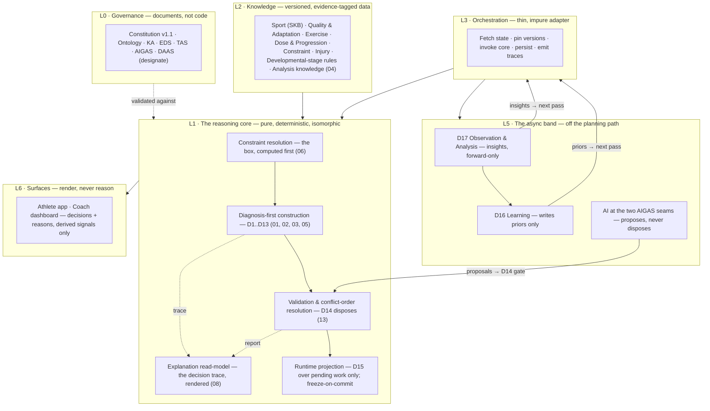

# Decision Engine V2 — Architecture

**Status: PROPOSAL — working doc (T4) · 2026-07-14 · not canonical; adopted only via DEVELOPMENT-PLAN §5.3**
**Sprint spec: [`docs/superpowers/specs/2026-07-14-decision-engine-v2-design.md`](../../superpowers/specs/2026-07-14-decision-engine-v2-design.md)**

---

This is the anchor document of the V2 proposal set. It has four parts:

- **§1** is written from a blank page: how an elite coach thinks, as pure
  coaching reasoning — no reference to the decision catalogue, the codebase, or
  any implementation.
- **§2** derives the engine that thinking implies, and states the sprint's
  load-bearing design commitments (spec §5) as V2 positions with their audit
  evidence.
- **§3** reconciles every §2 element against the **ratified v1.1 governing
  set** (amended 2026-07-13) and the DAAS *(designate, in review)* — verdict per
  element: `AGREES` / `DEEPENS` / `DIVERGES`.
- **§4** is the Amendment Register: NEW divergences only, queued for the
  amendment process, never applied here. The 2026-07 batch (AQ-1–AQ-9) is
  landed history — it is reconciled *against* in §3 and never re-queued.

Claims about the shipped engine cite the Sprint 2 forensic audit
(`docs/reviews/2026-07-11-engine-audit-01…10`) by finding ID, always as facts
**as of the audit pin (`main @ 02f6184`, 2026-07-11)**; where Phase 0 Wave A
(PRs #173/#174) altered a pinned finding, the fix reference is given alongside.
Live status lives in HANDOFF.md, never here.

---

## §1 How an elite coach thinks

*The blank page. What follows is the reasoning loop of an elite strength &
conditioning director, written as coaching, not as software. Every step states
the question the coach is answering and what a wrong answer costs the athlete.
The loop is the platform's mission made procedural: find the highest-value
intervention for this athlete now — given their goal, their sport, their
limiting factors, their recoverability, and the life they actually live — and
keep finding it as the athlete changes.*

### 1.1 Know the athlete

The first question is never "what program?" It is **"who is this?"** — their
training history and training age, what they can demonstrably do today, how
they have been injured before, how old they are and where they sit in their
athletic development, what equipment and hours they truly have, and what they
are asking for in their own words. A coach also knows the difference between
what has been *measured* and what is merely *assumed*, and holds the assumed
parts loosely. The cost of a wrong answer is total, because every later
judgement inherits it: prescribe to an imagined athlete and the plan is built
for someone who does not exist — too heavy for the returning forty-five-year-old,
too timid for the well-trained twenty-five-year-old, and unsafe for the
fifteen-year-old who was reasoned about as an adult.

### 1.2 Understand the demand

The second question: **"what does the thing they are chasing actually
require?"** Every pursuit — a sport and position, a race distance, or simply
"be stronger" — makes specific demands: which physical qualities matter most
and in what proportion, which movements and energy systems carry the outcome,
what the competitive calendar looks like, and where the pursuit habitually
breaks its athletes. The demand belongs to the athlete's goal, never to the
coach's preferences. Get this wrong and the athlete trains diligently for the
wrong event: the winger is given a powerlifter's winter, the marathoner's gym
work erodes the very freshness their mileage needs, and the injury the sport
was always going to threaten arrives untrained-against.

### 1.3 Diagnose what limits performance

Now the pivot, where coaching actually happens: **"of everything that could be
better, what is holding this athlete back the most, right now?"** The coach
lays what the athlete has against what the pursuit demands, quality by quality,
and reads the gaps — weighted by how much each gap matters, how trainable it is
in this season of the athlete's life, and how much risk it carries. An honest
coach also grades their own diagnosis: made from tests and observed performance
it is a finding; made from an intake conversation it is a hypothesis, stated as
one. A wrong or dishonest diagnosis is the most expensive error in coaching —
months of effort spent strengthening what was never the problem, while the true
limiter, unnamed, keeps taxing every performance and quietly caps everything
the plan was promising.

### 1.4 Choose the few things worth changing

Diagnosis produces a list; coaching is refusing most of it. The question:
**"which one, two, at most three gaps do we close first, for the highest
return?"** Chasing everything trains nothing — adaptations compete for the same
recovery, and some interfere with each other outright. The coach picks the few
priorities that are trainable now without compromising the sport, compatible
with each other, and worth the most to the outcome; the rest are consciously
parked, not forgotten. Choose wrong — or choose everything — and the athlete
gets the tired generalist's program: busy weeks, diluted stimulus, nothing
moved far enough to matter, and the priorities that were parked silently
becoming holes nobody is watching.

### 1.5 Decide the strategy and the season structure

Before a single session exists, the coach answers: **"in what order, and around
what calendar?"** Qualities are sequenced so each block of weeks develops one
thing dominantly while holding the others; interfering work is separated or
deliberately traded; the whole arc is laid against the season — build furthest
from competition, sharpen approaching it, protect and maintain inside it, and
arrive at the days that matter fresh, not merely trained. A wrong answer here
wastes right answers elsewhere: adaptations built in the wrong order undo each
other, fitness peaks in the wrong month, and the athlete is strongest the week
nobody is watching and exhausted the week everybody is.

### 1.6 Construct the smallest sufficient sessions

Only now do exercises appear. Each session answers **"what is today for, and
what is the least that genuinely achieves it?"** — one clear purpose, expressed
first as the movement and loading characteristics the purpose requires, then as
the exercises this athlete can actually and safely do, inside the box that
reality has drawn: their hours, their equipment, their injuries, this week's
fixtures, how recovered they arrive. Sufficient is load-bearing — a stimulus
too small to adapt to is not caution, it is waste — and so is smallest: work
added merely to fill the booked hour is fatigue with no purpose, spent from the
same recovery budget the sport needs. Both failures cost the same thing: the
athlete's finite capacity to adapt, spent without return.

### 1.7 Check the work against safety and reality

A good coach separates writing the plan from signing it. Before anything
reaches the athlete: **"would I stake my judgement on this?"** Is every
prescription within this athlete's demonstrated competency and clear of their
contraindications; does the week's total load — gym, sport, and life together —
stay within what they can recover from; does it protect the sport it claims to
serve; is it lawful and defensible at this athlete's age and stage? When checks
collide, the order of authority is fixed and known in advance: safety first,
then the sport, then recoverability, then the athlete's own commitments, then
the objective, and only then optimisation. Skipping the signature is how
plausible plans hurt people — the overreaching week that was obvious in
hindsight, the contraindicated lift that "fit the objective."

### 1.8 Deliver with reasons

A prescription arrives with its reasoning or it is a demand, not coaching:
**"can I tell this athlete, in their language, why this, why now, and how sure
I am?"** The reasons are the real ones — the ones the plan was actually built
from — including what was compromised and why: the volume trimmed to keep the
week recoverable, the quality deferred to next block, the need identified that
this program cannot yet serve. And the athlete keeps the final word; a coach
recommends, adjusts openly, and never rewrites what an athlete has already
committed to. The cost of silence is the relationship itself: an athlete who
cannot hear the why will not push through the hard weeks, quietly edits the
plan themselves, and eventually stops believing — and a plan nobody believes in
is a plan nobody follows.

### 1.9 Watch what happens

Every plan is a bet, and the athlete's response is the referee. So the coach
watches: **"what actually happened — and what does it mean?"** What was done
versus prescribed, how loads moved, how the athlete presents day to day, what
the tests and the competition results say — read against *this athlete's* own
baselines, not a textbook's, and interpreted before anyone reacts to it. A
single bad morning is noise; a three-week drift is a message. Meaning comes
first, action second: the week is adjusted for the athlete in front of you,
honestly and visibly, without panic-rewriting the season on one data point. A
coach who does not watch is flying blind between check-ins; a coach who watches
but overreacts turns every wobble into whiplash. Both lose the signal.

### 1.10 Learn and re-diagnose

Last, the loop closes: **"was my bet right — and what do I now believe about
this athlete that I did not believe before?"** The block's outcome is scored
against what it predicted; what worked, how fast this athlete actually
recovers, how they truly respond to a kind of stimulus — these become the
priors the next cycle is reasoned from, and the diagnosis itself is retaken,
because closing one gap promotes another to limiter. This is what separates a
coach from a program: the thousandth decision is better than the first, and it
is better *about this athlete specifically*. Skip it and every cycle restarts
from the same assumptions — the athlete grows, the coaching does not, and the
understanding that should compound into the athlete's most valuable asset
simply evaporates.

### 1.11 The loop, whole

Know the athlete → understand the demand → diagnose the limiters → choose the
few priorities → set the strategy and season → build the smallest sufficient
sessions → check them against safety and reality → deliver with reasons →
watch what happens → learn, and diagnose again. Two products come out of this
loop, inseparable: the **program**, and the **understanding of the athlete**
that makes the program right and makes next season's program better. A
generator produces only the first. A coach produces both, and that is the
standard V2 is designed to.

---

## §2 The engine that thinking implies

### 2.1 From reasoning to shape

Each step of §1 forces an architectural property. None of these is a style
preference; each is the smallest structure under which the §1 behaviour is
possible and its failure mode is impossible to express.

1. **The loop is a fixed order of judgements → the engine is an explicit,
   ordered graph of decisions.** §1's steps are decisions, each with inputs,
   reasoning, an output, a confidence, and consumers. V2's atomic unit is the
   coaching decision (Constitution Art 4); sessions are rendered *from*
   decisions, never assembled directly. The graph is the ratified catalogue —
   the planning spine D1→D14, runtime adaptation D15, learning D16, and the
   observation-and-analysis family D17 (EDS §20) — with every stage's
   operational contract specified in `02-COACHING-PIPELINE.md`.
2. **The same athlete must get the same answer → the reasoning core is pure
   and deterministic.** §1.7's "would I stake my judgement on this?" is only
   testable if the judgement is reproducible. No clock reads, no randomness,
   no I/O inside the core (Constitution Art 18; TAS §5.0); dates come from
   inputs; every artefact carries its `engineVersion × knowledgeSetVersion`
   provenance stamp (TAS §5.12).
3. **The coach's knowledge is citable and revisable → knowledge is consumed,
   never contained.** What a sport demands, what an exercise transfers to,
   what a dose achieves, *and every magnitude and coefficient that says how
   much* — all of it is versioned, evidence-tagged data the core reads
   (Constitution Art 17; KA §1–§2), reviewable by a sports scientist without
   reading engine code. `04-KNOWLEDGE-OWNERSHIP-MAP.md` closes ownership over
   every input the pipeline names.
4. **Reality draws the box before the plan is written → constraints resolve
   before construction.** §1.6 builds *inside* the box of time, equipment,
   injuries, calendar, and readiness. V2 places a dedicated constraint layer
   ahead of the session builder: the full constraint set is resolved into one
   typed artefact that construction consumes as an input — injuries shape
   selection up front, with post-construction validation as the backstop it
   was always meant to be, not the primary defence (Constitution Art 19
   "constraints are computed before content"; `06-CONSTRAINT-ENGINE.md`).
5. **Writing and signing are separate acts → construction proposes,
   validation disposes.** An independent suite of pure validators checks
   safety, recoverability, sport-compatibility, lawfulness, and scientific
   consistency, and can **trim or veto** any construction path's output —
   deterministic, human-overridden, or AI-proposed alike (Constitution Art 19;
   EDS §35). Conflicts resolve by the Constitution's conflict order compiled
   into an explicit, testable resolution pass inside D14 (§2.3 C1).
6. **Reasons are delivered, compromises are surfaced → explanation is a
   read-model over the decision trace.** Every decision emits rationale and
   confidence as data; the athlete-facing explanation is assembled from that
   trace, never reconstructed after the fact as a parallel story (Constitution
   Art 14; TAS §11). Every trim, veto, cap, and unservable need is recorded
   and surfaceable (Constitution Art 15). `08-EXPLAINABILITY.md` specifies the
   read-model.
7. **Watching is interpretation before action → analysis is its own decision
   family, off the planning path.** §1.9's "what does it mean?" is D17
   Observation & Analysis (EDS §20): pure interpretation over the athlete's
   accumulated data, asynchronous, insights forward-only into the next
   diagnosis, the runtime pass, and learning — never reshaping a plan itself.
   The data it reads and the products it emits are governed by the DAAS
   *(designate, in review)* — V2 consumes that pillar, never re-owns it
   (DAAS §1.3).
8. **The plan is a promise → runtime adapts by projection, never mutation.**
   The generated plan is immutable; adaptation is a read-time projection over
   *pending* work only, and a committed session is frozen absolutely
   (Constitution Art 10; EDS D15). The human — athlete or coach — holds the
   final word at every decision boundary, through the same substitution seam
   an AI would use, and the validators still gate every substitution.
9. **Learning changes beliefs, not plans → learning writes only priors.**
   §1.10's updated beliefs enter the engine exclusively as versioned priors
   the *next* pure planning pass reads (Constitution Arts 16, 18; EDS D16) —
   three tiers, population → sport → athlete-specific, updated asynchronously,
   off the request path (TAS §4.5).
10. **The understanding is the second product → the athlete's longitudinal
    record is first-class and athlete-owned.** Measurement enters diagnosis
    through Family VIII vocabulary (Assessment → Test Result; Ontology §10);
    the career-long record, its provenance, and its consent, export, and
    erasure rights are the DAAS's territory (§3, §3.5 — designate), under the
    athlete's ownership (Constitution Art 22). V2 reads the record; it never
    becomes its landlord.

### 2.2 The V2 shape

The properties above compose into the layered shape the TAS already governs
(TAS §3.2) — V2 *fills* that shape rather than redrawing it. One pure engine,
not many: assessment, planning, validation, readiness, and recommendation are
decisions inside the one reasoning core (TAS §3.1), not separate engines.

*(Parenthesised numbers name the proposal-set document that specifies each
element. L4 platform services are unchanged from TAS §4.4 and omitted for
clarity. The diagram is a design artefact, non-normative; the TAS layer
definitions govern.)*

### 2.3 The load-bearing commitments (spec §5), as V2 positions

These are the calls the rest of the set develops in full. Each is stated here
as a V2 position with its evidence; the owning document carries the design.

- **C1 · The conflict order becomes code.** The Constitution's tier order
  (Safety & Law > Sport Protection > Recoverability > Athlete Intent >
  Objective Fidelity > Optimisation) is, at the audit pin, implemented
  implicitly in scattered penalty weights and gate ordering — "the order
  itself exists nowhere as code" (audit 02 §3). V2 specifies it as an
  explicit, testable resolution pass inside D14: every validator verdict
  carries its tier, and inter-verdict conflicts resolve by the compiled order,
  with the resolution recorded in the validation report. Owner: `13`, with
  `02` stage contracts.
- **C2 · Constraints resolve before construction.** At the pin, injuries were
  runtime-first with a render backstop, producing the empty-rehab defect class
  (TR-04; audit 06 · SR-03; audit 07; the immediate defects were addressed by
  Wave A, PRs #173/#174 — the architectural position stands). V2 places a
  dedicated constraint engine ahead of the session builder: one resolved,
  typed constraint artefact consumed by every construction decision. Owner:
  `06`.
- **C3 · The HOW-MUCH becomes knowledge.** The audit found the WHAT layer
  genuinely knowledge-driven but ~30 shape literals, sport-fact sets, and bare
  coefficients at full authority in code (TR-12; audit 06 · SR-07; audit 07 ·
  audit 05 §4). V2's knowledge-ownership map closes this class: every
  magnitude the pipeline reads has a named knowledge home with provenance and
  confidence. Owner: `04`.
- **C4 · Progression is a first-class architecture.** The audit's most
  critical scientific finding: no progressive overload for non-logging
  athletes (SR-01; audit 07 · G9; audit 08). V2 designs progression at all
  eight levels — adaptation, exercise, weekly, mesocycle, block, season,
  annual, long-term athlete development — never as a dose add-on, with the
  LTAD level honouring Constitution Art 21's developmental-stage duty as
  governed knowledge. Owner: `07`.
- **C5 · Validation disposes.** Art 19's verb does not happen at the pin:
  5 of 16 validators, report-only at both boundaries, the report reaching no
  screen (TR-02; audit 06; Art 19 scored 3/10 — audit 02 §1). V2 specifies the
  full validator suite and the report → flag → gate enforcement ladder, with
  a false-positive budget measured before any promotion. Owner: `13`.
- **C6 · Explainability at prescription.** The engine at the pin explains its
  *adjustments* well and its *plan* thinly — the asymmetry is the trust gap
  (audit 03 §5). V2's explanation architecture is the engine's own decision
  trace rendered (Art 14): why this exercise, this dose, this order, this
  schedule, at the moment of prescription. Owner: `08`.
- **C7 · One selection engine.** The legacy volume-first fill — serving every
  triathlete, zero-gap run/cycle athletes, and code-less GAA rows at the pin
  (B1; audit 04 · G6; audit 08; cohort rescue landed in Wave A, PR #173) — is
  designed out entirely. Its retirement is a migration phase with
  cohort-rescue acceptance criteria, not a cleanup. Owners: `10`/`11`.
- **C8 · Measurement enters diagnosis.** Nine of ten capability estimates
  were training-age priors at the pin (SR-02; audit 07 · G1, G3; audit 08).
  V2 gives D1 per-quality measured estimators behind the same interface,
  honouring "additive first — no new data ⇒ byte-identical plan". The
  vocabulary is ratified: Assessments produce Test Results (Ontology §10,
  Family VIII); capture and battery mechanics are DAAS-owned (§2.1.2 —
  designate) — V2 consumes, never re-owns. Owner: `03`, with `02`.
- **C9 · Analysis is D17.** The audit's missing measure/learn-adjacent verbs
  land in the ratified D17 Observation & Analysis family (EDS §20): pure
  interpretation in the async band, insights forward-only, the D15/D16/D17
  boundary honoured exactly as the EDS states it. Any genuinely new pass this
  set surfaces enters through EDS §20.1's four admission criteria (mirrored by
  Ontology §13) — never an ad-hoc stage name (see §4.1). Owners: `02`, `03`.

---

## §3 Reconciliation against the frozen set

The reconciliation target is the **amended v1.1 set, ratified 2026-07-13**:
the Constitution's 22 Articles (including the amended Preamble's second
product and the Title III Articles 21/22), the Decision Ontology's four
structures (§1.1–§1.4) and Family VIII, the Knowledge Architecture, the EDS
D1–D17 catalogue with §20.1, the TAS, and AIGAS — plus the DAAS as the data
pillar's owner, cited *(designate, in review)* throughout. The 2026-07
batch's additions are frozen owners to reconcile against, never gaps to
rediscover.

Verdicts: **AGREES** — V2 adopts the owner's position, adding at most
operational detail the owner explicitly leaves open; **DEEPENS** — V2 builds
substantial new operational architecture on the owner's principle, without
contradicting it; **DIVERGES** — V2 proposes something the owner's text does
not permit (requires an Amendment Register entry in §4).

| V2 element (§2) | Frozen owner (doc + §/Art) | Verdict | Note |
|---|---|---|---|
| The coaching decision as atomic unit; sessions rendered from decisions | Constitution Art 4; EDS §19 | AGREES | V2 adds no new decision semantics; contracts per EDS §19's fields. |
| Explicit decision graph = the ratified catalogue D1–D17, planning spine D1→D14 | EDS §20, §20.1; Ontology §2 (Reasoning Spine) | AGREES | The spine is kept verbatim — no rewiring, no re-ordering, no ad-hoc stages. Any new pass routes through §20.1 (§4.1). |
| Pure, deterministic, isomorphic reasoning core; provenance stamps | Constitution Art 18; TAS §3.1, §5.0, §5.12; EDS SA1 | AGREES | The audit's crown jewel survives unchanged (audit 10 §2). |
| Typed decision contracts enforced at runtime as the engine's fabric | Constitution Art 4; EDS §19; TAS §5.3 | DEEPENS | TAS §5.3 names the contracts module and calls enforcement non-negotiable; at the pin contracts existed on paper plus one seam (audit 02 §1, Art 4). V2 specifies the enforcement mechanics per stage (`02`). |
| Diagnosis-first order; qualities not muscles; volume as ledger | Constitution Arts 5, 6; Ontology §1.1, §1.3 (Diagnostic Triangle) | AGREES | The pivot and its order are the ratified design; V2 operationalises inputs (C8), not the order. |
| Knowledge consumed, never contained — closure over the HOW-MUCH class | Constitution Art 17; KA §1, §2, §3.1; TAS §4.2 | DEEPENS | The principle is ratified; V2 extends its *reach* to every magnitude and coefficient (C3) via the ownership map (`04`). New entries use existing domains (KA §4) wherever possible. |
| Constraint layer resolved before construction into one typed artefact | Constitution Art 19 ("constraints are computed before content"), Art 8; EDS §36; Ontology §8 (Constraint) | DEEPENS | The rule is constitutional; the dedicated resolution layer and single artefact are V2 operational architecture (C2, `06`). Whether it registers as a named pass is settled by `02` under EDS §20.1 (§4.1) — it rewires no existing edge. |
| Construction proposes, validation disposes — full suite + enforcement ladder | Constitution Art 19; EDS §35, D14; TAS §5.6 | DEEPENS | Suite membership is EDS §35's; the report → flag → gate ladder and false-positive budget are operational depth the owners leave open (C5, `13`). |
| The conflict order as an explicit, testable resolution pass inside D14 | Constitution "When principles conflict"; EDS §37; TAS §5.6 | DEEPENS | The order *is* the Constitution "compiled into a decision procedure" — V2 performs the compilation as code with recorded resolutions (C1). |
| Explanation as a read-model over the decision trace, at prescription | Constitution Arts 14, 15; TAS §11, §5.10 | AGREES | "Explanation is not re-derived after the fact… a projection over the trace" (TAS §5.10) — V2 builds exactly that projection (`08`). |
| Progression architecture at eight levels, anchored to demonstrated progress | Constitution Art 7 ("sufficient, progressed, never padded"); EDS §34, D12 | DEEPENS | The set demands progression as first-class; the eight-level decomposition is V2's operational design (C4, `07`). Any new pass it needs routes through §20.1 (§4.1). |
| LTAD / developmental-stage prescription; stage rules as governed knowledge | **Constitution Art 21**; KA §4 (knowledge home); Ontology §3 (Athlete) | AGREES | Developmental stage is a first-class input shaping diagnosis and construction; stage rules enter as governed, evidence-tagged knowledge, conservative where evidence is thin — V2 adopts Art 21's implications verbatim (`07`, `03`). |
| Measurement enters diagnosis: per-quality estimators behind the same interface | Constitution Arts 5, 12; Ontology §10 Family VIII (Assessment, Test Result); EDS D1; DAAS §2.1.2 *(designate)* | DEEPENS | Vocabulary and capture owners are ratified/designate; the estimator architecture and additive-first guarantee are V2 depth (C8, `03`). |
| Analysis as the D17 family: async, insights forward-only, D15/D16/D17 boundary | EDS §20 D17; Ontology §1.4 (Analysis Spine); DAAS §2.3, §2.4 *(designate)* | AGREES | V2 adds members only via §20.1; it never widens D17's wiring — one gate, three routes (DAAS §2.4, designate). |
| Learning writes only priors; three tiers; async, off the request path | Constitution Arts 16, 18; EDS D16, §25; TAS §4.5, §10 | AGREES | Priors remain the only learning channel toward the core; promotion policy detail lives in `07`/`10` within that channel. |
| Runtime adaptation as pure projection over the immutable plan; freeze-on-commit | Constitution Art 10; EDS D15; TAS §5.11 | AGREES | The pin-verified discipline (audit 01 §6) is preserved as-is. |
| Human/coach override at any decision boundary, recorded, learned from, still validated | Constitution Art 10; Ontology §9 (Override); TAS §5.11 | DEEPENS | The owners define the seam; V2 specifies the coach-side substitution operationally (absent at the pin — audit 02 §2), proving the seam a future AI uses. |
| Athlete-data elements: longitudinal record, consent-based grants, export/erasure, secondary-use gate | **Constitution Art 22**; Art 11 (raw-vitals ceiling); DAAS §3, §3.5 *(designate)* | AGREES | Every athlete-data surface V2 touches binds to Art 22: grants are scoped, consented, revocable; consent widens *who*, never deepens *what* (Art 11 caps every grant). V2 consumes the DAAS-owned record; it re-owns nothing (DAAS §1.3/§1.4). |
| Squad/team surfaces read derived signals only | Constitution Art 11; DAAS §5 *(designate)*; TAS §8.1 | AGREES | Coach views stay derived-only; V2 adds no cross-person surface of its own. |
| One selection engine for every cohort; legacy volume-first fill designed out | Constitution Art 6; EDS D11, §34 | AGREES | Retiring the inverted path is *conformance* to the ratified owner, not a change to it (C7; B1; audit 04). |
| AI proposes at the two seams only; deterministic validators keep the last word | Constitution Art 18; AIGAS §3, §6, §11; TAS §5.13 | AGREES | V2 changes nothing at the AI boundary; `09` binds the set's AI touchpoints to AIGAS's categories and gates unchanged. |
| The layered shape: pure core / knowledge / orchestration / platform / async band / surfaces | TAS §3.2, §3.3 | AGREES | V2 fills the TAS's layers and relocates no boundary; any analytics-shaped tension follows the DAAS's recorded TAS-clarification candidate (DAAS §1.2), not a new reading. |

**Result: 14 AGREES · 8 DEEPENS · 0 DIVERGES.** No V2 element requires the
amended v1.1 set to change. This is the expected outcome, not a surprise: the
audit itself concluded the architecture is the Constitution's shape and that
"no amendment is required by anything in this audit" (audit 10 §2), and the
2026-07 batch ratified precisely the owners (Arts 21/22, Ontology §1.4 +
Family VIII + §13, EDS D17 + §20.1, the derived-data doctrine) that this
design's progression, athlete-data, measurement, and analysis elements needed
to reconcile against.

---

## §4 Amendment Register

Format: `AR-n | Frozen doc + § | What V2 proposes instead | Why (evidence) |
Status: QUEUED — candidate for the amendment process (never applied here)`.

| AR | Frozen doc + § | What V2 proposes instead | Why (evidence) | Status |
|---|---|---|---|---|
| — | — | — | — | — |

**The register is empty, and that is the finding.** §3 produced zero DIVERGES
verdicts: every V2 element reconciles to a ratified owner (or to the DAAS as
designate) as AGREES or DEEPENS. The 2026-07 batch (AQ-1–AQ-9) is landed
history — reconciled against in §3, never re-queued — and the two divergence
candidates the parked 2026-07-11 plan pre-flagged were resolved by that
ratification: quality-vocabulary growth is an additive extension through
Ontology §13, and new pipeline passes enter through EDS §20.1. Only a
genuinely *structural* conflict with the amended text — redefining an entity,
rewiring the D1→D14 spine, contradicting an Article — would earn an AR row;
this design contains none. Should a later document in this set surface one,
it registers here (AR-1, AR-2, …) with its evidence, and is queued — never
applied — per DOCUMENTATION-GOVERNANCE §3.

### §4.1 Additive-extension candidates (not amendments)

Routine, batchable growth through the ratified extension lanes. These are
**proposed** entries — ratification belongs to the amendment-batch process and
Simon, never to this set (spec §8).

| AE | Lane | Candidate | Evidence / origin | Where developed |
|---|---|---|---|---|
| AE-1 | Ontology §13 (additive: new entities in an existing family) + the paired knowledge entries | **Quality-vocabulary expansion** — new Physical Quality entries so sport-defining demands (e.g. neck strength, collision robustness, aerial ability, strength endurance) survive into diagnosis instead of being dropped by a fixed projection | SR-05 (audit 07) · B3 (audit 04): 11 authored SKB quality names discarded before diagnosis at the pin, with no `droppedDemands` record | `03-PERFORMANCE-MODEL.md` proposes the entry list; `04-KNOWLEDGE-OWNERSHIP-MAP.md` homes the paired demand/measurement knowledge; pairing rule: measure what you newly diagnose (audit 10 §3, Wave C) |
| AE-2 | EDS §20.1 (proposed admission: new decision or new D17 family member) | **Any pass this set surfaces beyond D1–D17** — both candidates flagged at authoring time were discharged without admission: the constraint layer is a resolved artefact, not a pass (`02` §4 R4; `06`), and progression state is pure recomputation inside D7/D12/D15 (`02` §4 R3; `07` §6). The lane stays open for any future pass, each admitted only with all four §20.1 criteria stated in full (contract completeness, graph position, validation & explainability integration, knowledge separation) | Global Constraint 8 of the sprint plan; EDS §20.1's admission door replaces the parked plan's ad-hoc stage-naming workaround | `02-COACHING-PIPELINE.md` is the naming authority and states each proposed admission in full; until admitted, every reference uses the proposed id. As of this set: **zero proposed admissions** (`02` §4, "The stage list, closed") |

Nothing in this section — and nothing in this document — edits a frozen file,
applies an amendment, or claims adoption. The set becomes binding only via
DEVELOPMENT-PLAN §5.3.
