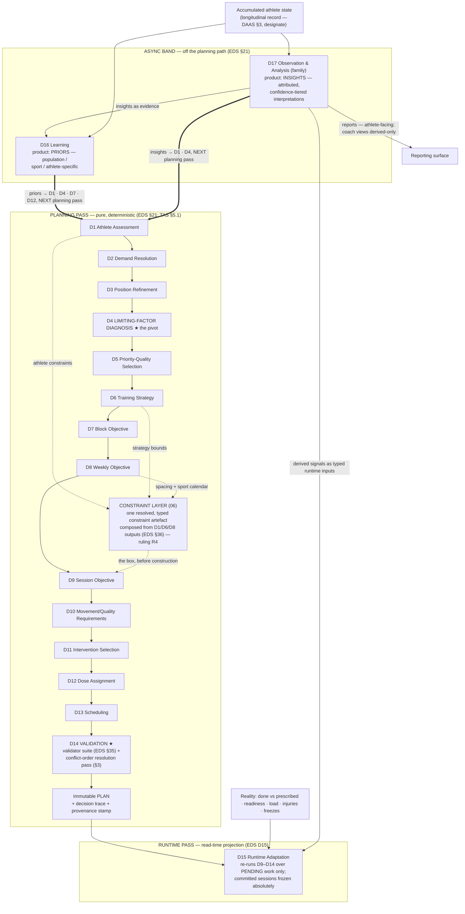

# Decision Engine V2 — The Coaching Pipeline

**Status: PROPOSAL — working doc (T4) · 2026-07-14 · not canonical; adopted only via DEVELOPMENT-PLAN §5.3**
**Sprint spec: [`docs/superpowers/specs/2026-07-14-decision-engine-v2-design.md`](../../superpowers/specs/2026-07-14-decision-engine-v2-design.md)**

---

## §0 How to read this document — the stage-naming authority

This document is the **stage-naming authority** for the entire V2 proposal set.
The stage vocabulary is the **ratified EDS §20 catalogue, D1–D17, exactly** —
seventeen decisions, no more, no fewer, no ad-hoc names. Every later document
in the set (Tasks 5–14) uses the stage IDs fixed here verbatim, and the
provisional "Maps to" cells of
[`01-DECISION-HIERARCHY.md`](01-DECISION-HIERARCHY.md) are settled by §4's
rulings. As of this document there are **zero proposed EDS §20.1 admissions**:
every pass the V2 design needs lives inside the ratified seventeen (§4 states
where the two candidates flagged in `00-ARCHITECTURE.md` §4.1 AE-2 landed and
the return path if a later document genuinely needs the §20.1 door).

Three rules govern everything below:

1. **The EDS owns each decision's behaviour.** Every stage entry LINKS its
   ratified contract ([EDS §20](../../engine/00-ENGINE-DESIGN-SPECIFICATION.md))
   and adds **only the operational fields the EDS leaves open** — enforcement
   mechanics, override seams, validation hooks, failure handling detail.
   Nothing here restates, narrows, or widens a ratified contract (one owner
   per concept; a contradiction would be an Amendment Register entry in
   `00-ARCHITECTURE.md` §4, never a silent divergence).
2. **Every stage gets the same ten fields.** §2 specifies each stage as a
   definition list of exactly: *Purpose · Inputs · Knowledge Required ·
   Decision Rules · Outputs · Dependencies · Validation Rules · Failure
   Conditions · Coach Override Capability · Confidence Level*. Knowledge
   Required names KA §4 domains only — entry-level detail is
   `04-KNOWLEDGE-OWNERSHIP-MAP.md`'s job. Outputs are typed and carry the
   `{value, confidence, rationale}` contract (TAS §5.3; EDS §19).
3. **Design artefact, non-normative.** Interface sketches and type names here
   are proposals; the frozen owners govern. Claims about the shipped engine
   cite the Sprint 2 audit as facts as of the audit pin
   (`main @ 02f6184`, 2026-07-11).

---

## §1 The pipeline at a glance

### 1.1 The stage table (the definitive list)

All seventeen ratified stages, in dependency order. `Hierarchy level` cites
[`01-DECISION-HIERARCHY.md`](01-DECISION-HIERARCHY.md)'s thirteen levels of
coaching judgement; stages with no level are how decisions *reach* the athlete
safely, not further altitudes of judgement (01 §10).

| ID | Name | One-line purpose | Hierarchy level (01) |
|---|---|---|---|
| **D1** | Athlete Assessment | Build the structured, confidence-honest model of who this athlete is right now | 1 · Athlete |
| **D2** | Demand Resolution | Resolve what the athlete's goal/sport requires into a structured demand profile | 2 · Goals (its input boundary) + 3 · Performance Outcomes (resolved within) |
| **D3** | Position / Individual Demand Refinement | Refine the demand profile for position/event and personal specifics | the level-3→4 edge (demand side of the Diagnostic Triangle) |
| **D4** | Limiting-Factor Diagnosis ★ | Identify what most constrains this athlete's performance now — the pivot | 4 · Adaptation Targets (diagnosis half) |
| **D5** | Priority-Quality Selection | Choose the few qualities (and their adaptation targets) worth developing this block | 4 · Adaptation Targets (response half — ruling R2) |
| **D6** | Training Strategy | Commit intervention classes per target and the concurrency/sequencing model | 5 · Interventions (class commitment — ruling R1) |
| **D7** | Periodisation / Block Objective | Structure the macrocycle into blocks, each with one dominant objective | 6 · Training Block Objectives |
| **D8** | Weekly Objective (microcycle) | Lay each week's loading pattern around the fixed sport schedule | 7 · Weekly Objectives |
| **D9** | Session Objective | Give each session exactly one named purpose with a fatigue budget | 8 · Session Objectives |
| **D10** | Movement / Quality Requirements | Translate the session objective into movement and loading characteristics — before any exercise is named | 9 · Exercise Selection (requirements half) |
| **D11** | Intervention Selection | Choose the minimum effective set of interventions satisfying the requirements | 9 · Exercise Selection (selection half; level 5's concrete recurrence) |
| **D12** | Dose Assignment | Assign the minimum effective dose per intervention for the target adaptation | 10 · Programming Variables (+ 11 · Progression, its dose arm — ruling R3) |
| **D13** | Scheduling | Place sessions on days to optimise recovery and minimise interference | — (placement, not a judgement altitude — 01 §10) |
| **D14** | Validation ★ | Verify, then trim or veto — construction proposes, validation disposes; hosts the conflict-order resolution pass (§3) | — (the signature, not a judgement altitude — 01 §10) |
| **D15** | Runtime Adaptation (reflow) | Reshape pending work only, by re-running D9–D14 over the immutable plan | 11 · Progression (runtime arm — ruling R3); re-enters levels 8–10 |
| **D16** | Learning | Update beliefs — write priors only, three tiers, async | 13 · Iteration |
| **D17** | Observation & Analysis (family) | Decide what the athlete's accumulated data means — before anyone decides what to do about it | 12 · Review |

D17 is a decision **family** (EDS §20 D17): its five ratified members —
**signal derivation, trend & anomaly detection, benchmark comparison, squad
roll-up, report assembly** — share one contract and one graph position; new
members register additively under EDS §20.1, never as new stage numbers.

### 1.2 The pipeline flow

Three passes and an async band, exactly as the ratified graph draws them
(EDS §21; TAS §5.1). The constraint layer (`06-CONSTRAINT-ENGINE.md`'s
subject) and the conflict-order resolution pass (§3, inside D14) are marked.



Read the boundaries as load-bearing (EDS §20's D15/D16/D17 note, verbatim in
authority): **D17 decides what the data means; D15 decides what the athlete
does about it this week; D16 decides what the engine believes differently next
time.** The two async products are distinct and never interchangeable — an
insight *describes the athlete's data*; a prior *parameterises future
decisions*. Insights travel forward only — into the next planning pass (D1/D4),
into D15 as typed inputs, into D16 as evidence, and into reporting — never
backward into a committed plan (EDS §21). D17 is the sole entry for any
analytical product reaching any decision (DAAS §2.4 — designate, in review).

---

## §2 Stage specifications

One subsection per stage; every stage carries all ten fields. Where the EDS
specifies behaviour, the entry links it and adds only what the EDS leaves
open. Output types are design sketches (non-normative); every output is a
typed artefact carrying `{value, confidence, rationale}` (TAS §5.3) and every
run contributes to the decision trace and provenance stamp (TAS §5.5, §5.12).

Two mechanics apply to **all seventeen stages** and are stated once here,
then assumed:

- **Contract enforcement (TAS §5.3).** Inputs and outputs are validated at
  every stage boundary by the contracts module — in development and CI a
  violation fails fast; in production it triggers the stage's declared
  fallback and an audit event. Enforcement is non-negotiable: without it the
  graph degrades into the implicit pipeline it replaced.
- **The override seam (TAS §5.11).** Every override — coach or athlete —
  substitutes a stage's output *behind the same contract seam an AI proposal
  uses*, is recorded as an Override entity (Ontology §9), is fed to D16 as
  signal, and is **still disposed by D14's validators**. No override, human or
  AI, ever acquires the last word (Constitution Arts 10, 19).

### 2.1 D1 · Athlete Assessment — [EDS §20 D1](../../engine/00-ENGINE-DESIGN-SPECIFICATION.md)

- **Purpose** — Build the structured model of who this athlete is right now,
  honest about what is measured versus assumed (EDS D1; Constitution Art 5).
- **Inputs** — Onboarding answers; tracked lifts; training history;
  demographics incl. developmental stage (Constitution Art 21); Test Results
  and observations (Ontology §10 Family VIII; capture mechanics DAAS §2.1.2 —
  designate, in review); athlete-tier priors (from D16, previous loop); D17
  insights as assessment evidence (previous loop).
- **Knowledge Required** — Athlete Knowledge (KA §4 Domain 1);
  Evidence & Confidence Knowledge (Domain 10). Detail: `04`.
- **Decision Rules** — The EDS owns the reasoning (normalise, classify
  training age, estimate per-quality capability, attach per-estimate
  confidence). V2 operational additions: per-quality **measured estimators
  behind the same interface** (commitment C8; designed in
  `03-PERFORMANCE-MODEL.md` §5), with the additive-first guarantee — *no new
  data ⇒ byte-identical plan*; measured evidence always displaces inferred
  priors for the same attribute, and the displacement is recorded in the
  rationale (the audit's deepest gap: 1/10 qualities measured at the pin —
  SR-02; audit 07).
- **Outputs** — `AthleteModel` `{value, confidence, rationale}`: value =
  capability per Physical Quality, training age, per-movement competency,
  injury history/status, developmental stage, equipment/availability
  constraints, goal; confidence per attribute (high measured / low inferred);
  rationale names the source of every estimate (measured, inferred, prior).
- **Dependencies** — None (root of the graph). Priors and insights arrive as
  inputs from the *previous* loop, not as in-pass parents (EDS §21).
- **Validation Rules** — Contract check at the boundary; sanity bounds on
  entered lifts (EDS D1); developmental-stage presence for minors — an
  athlete model may never reason about a minor from adult physiology
  (Constitution Art 21), so a missing stage for an under-18 fails the
  contract rather than defaulting; every assumed attribute must be flagged as
  an assumption (TAS §5.8).
- **Failure Conditions** — Sparse onboarding ⇒ many low-confidence estimates
  and wider margins downstream, never a halt (EDS D1 ✗); mis-entered lifts ⇒
  sanity bounds now, D16 later; a missing safety-relevant field ⇒ the most
  conservative stage assumption, recorded in the trace and surfaced to the
  athlete — never silent (Constitution Art 15).
- **Coach Override Capability** — Overridable (TAS §5.11): a coach may assert
  capability, competency, or injury status they have observed; the assertion
  substitutes the estimate behind the seam, carries coach provenance, and is
  bounded by the same sanity checks. The athlete's *stated constraints* are
  not overrides — they are tier-4 Athlete Intent (Constitution, conflict
  order).
- **Confidence Level** — Per-attribute (Constitution Art 13; EDS §28.3):
  measured competency and contraindication facts may reach **gate** (they
  feed D11/D14 gates); inferred capability estimates are at most **soft
  input**; whole-model confidence is a **reported metric** surfaced to the
  athlete ("conservative while we learn").

### 2.2 D2 · Demand Resolution — [EDS §20 D2](../../engine/00-ENGINE-DESIGN-SPECIFICATION.md)

- **Purpose** — Determine what the athlete's goal/sport requires, as a
  structured demand profile (EDS D2). The athlete-supplied goal at this
  stage's head is hierarchy level 2 (Goals) — no stage *decides* a goal, and
  that absence is constitutional (Art 3; 01 §2).
- **Inputs** — Goal/sport (+ event, season window, intent, Performance
  Outcome with deadline where one exists — Ontology §4) from the
  `AthleteModel`; the sport's SKB module or the goal-as-sport profile for
  build goals.
- **Knowledge Required** — Sport Knowledge / the SKB (KA §4 Domain 2);
  Quality & Adaptation Knowledge (Domain 3). Detail: `04`.
- **Decision Rules** — The EDS owns the reasoning (registry lookup of the
  demand profile; no sport-specific code — the decision reads the sport
  module, KA §3.2). V2 operational additions: the resolved **Performance
  Outcome is carried as a typed field** of the demand profile so D16's
  transfer validation has a referee (01 §3 — the severed-loop lesson, audit
  03 §3.4); every authored demand the projection cannot serve is recorded in
  a `droppedDemands` list, never silently discarded (SR-05; audit 07 · B3;
  audit 04 — the vocabulary expansion itself is AE-1, `03`'s subject).
- **Outputs** — `DemandProfile` `{value, confidence, rationale}`: value =
  ranked quality requirements, energy-system targets, key movements,
  injury-risk map, season/competition context, resolved Performance Outcome;
  confidence inherited per-section from SKB evidence tags; rationale cites
  the SKB sections read (knowledge-access trace, TAS §5.4).
- **Dependencies** — D1.
- **Validation Rules** — SKB registry validation on load (structure,
  provenance, energy-system percentages ≈ 100, importances 1–10 — KA §3.2);
  contract check that every ranked requirement names a registered Physical
  Quality; `droppedDemands` must be present (possibly empty) — its absence is
  a contract violation.
- **Failure Conditions** — Unknown/stub sport ⇒ generic athletic demand
  profile + low confidence flag, never invented demands (EDS D2 ✗); a
  malformed SKB entry fails at registry load, never inside the pass (KA
  §3.2); dropped demands are surfaced per Art 15.
- **Coach Override Capability** — Partially overridable (TAS §5.11): a coach
  may re-weight demand emphases for their squad/position context (recorded,
  validated). The **goal itself is never coach-overridable** — the goal
  belongs to the athlete (Constitution Art 3), and any narrowing of means
  downstream may never substitute the end recorded here (01 §2).
- **Confidence Level** — Inherits SKB per-section confidence (Art 13):
  demand importances act as **soft input** to diagnosis; season/fixture
  structure supplied by the athlete or coach is factual and may **gate**
  scheduling; contested sport-science claims enter at **reported metric**
  until their evidence tier warrants more (KA §3.1).

### 2.3 D3 · Position / Individual Demand Refinement — [EDS §20 D3](../../engine/00-ENGINE-DESIGN-SPECIFICATION.md)

- **Purpose** — Refine the demand profile for the athlete's position/event
  and personal specifics (EDS D3) — the demand side of the Diagnostic
  Triangle's edge (01 §4).
- **Inputs** — `DemandProfile` (D2); position/event; individual demand
  signals (history, asymmetries, stated priorities).
- **Knowledge Required** — Sport Knowledge (KA §4 Domain 2 — position
  modifiers); Athlete Knowledge (Domain 1). Detail: `04`.
- **Decision Rules** — The EDS owns the reasoning (apply position modifiers;
  fold in individual signals; pass through when no position). V2 operational
  addition: refinements are expressed as **deltas over D2's profile**, each
  delta attributed to its source (position modifier vs individual signal), so
  the explanation layer can answer "why is your profile different from the
  sport default" (Art 14; `08`).
- **Outputs** — `RefinedDemandProfile` `{value, confidence, rationale}`:
  value = the refined profile + attributed delta list; confidence = SKB
  modifier confidence × individual-signal confidence; rationale per delta.
- **Dependencies** — D2.
- **Validation Rules** — Contract check; deltas must reference D2 profile
  entries (no orphan refinements); position modifiers must come from the
  registered sport module, never inline facts (Constitution Art 17).
- **Failure Conditions** — Missing position ⇒ pass-through, recorded as such
  (EDS D3 ✗); a position id absent from the sport module ⇒ pass-through +
  low-confidence flag surfaced, never a fabricated modifier (Art 15).
- **Coach Override Capability** — Overridable (TAS §5.11): position/role
  assignment and squad-context demand refinement are precisely the coach's
  knowledge; substitutions recorded and fed to D16.
- **Confidence Level** — Position modifiers inherit SKB confidence (**soft
  input**, Art 13); individual refinements start low and sharpen with data;
  nothing at this stage is gate-capable — refinement informs diagnosis, it
  never vetoes anything (EDS §28.3).

### 2.4 D4 · Limiting-Factor Diagnosis ★ — [EDS §20 D4](../../engine/00-ENGINE-DESIGN-SPECIFICATION.md)

- **Purpose** — Identify what is most constraining the athlete's performance
  now — the engine's central act of judgement, the pivot from understanding
  to response (EDS D4; Constitution Art 5; Ontology §1.3).
- **Inputs** — `AthleteModel` (D1); `RefinedDemandProfile` (D3); injury
  status; recent performance/assessment data; sport/athlete-tier priors
  (D16, previous loop); D17 insights as diagnosis inputs incl. re-diagnosis
  triggers (previous loop; EDS §23).
- **Knowledge Required** — Sport Knowledge (KA §4 Domain 2);
  Quality & Adaptation Knowledge (Domain 3); Injury Knowledge (Domain 9);
  Evidence & Confidence Knowledge (Domain 10). (The TAS names this exact
  read-set as its worked example — TAS §5.4.) Detail: `04`.
- **Decision Rules** — The EDS owns the reasoning (gap per quality =
  `demand_importance × (target − current)`, adjusted by trainability-now and
  injury-risk; rank). V2 operational additions: the full Diagnostic Triangle
  is walked, never jumped (01 §4); every diagnosed-but-unservable limiting
  factor is emitted on the output, not dropped (Ontology §5; Constitution
  Art 15); a diagnosis made from inferred capabilities is stamped
  low-confidence hypothesis (Art 5) — the honest-diagnosis duty is a typed
  property, not prose.
- **Outputs** — `RankedLimitingFactors` `{value, confidence, rationale}`:
  value = ordered limiters, each with magnitude, trainability-now,
  injury-risk weighting, and servability; confidence driven by the
  weakest-confidence input (TAS §5.7); rationale per limiter (the substrate
  of "why this plan" — Art 14).
- **Dependencies** — D1, D3.
- **Validation Rules** — Contract check; every limiter must name a
  registered Physical Quality and cite its demand and capability inputs
  (attributability); the diagnosis must be non-empty (see Failure
  Conditions); confidence must be ≤ the minimum input confidence — a
  diagnosis more certain than its inputs is a contract violation (TAS §5.7).
- **Failure Conditions** — No measured current levels ⇒ diagnose from
  population priors + sport risk profile at low confidence with conservative
  priorities — **never no diagnosis**: a generic athlete still has generic
  limiters (EDS D4 ✗); contradictory inputs (e.g. measured capability vs
  recent performance) ⇒ prefer the higher-confidence source, record the
  contradiction in the trace, and queue it as D17-visible evidence — never
  average silently (Art 15).
- **Coach Override Capability** — Overridable (TAS §5.11) — and this is the
  flagship coach seam: a coach substitutes their own diagnosis behind D4's
  contract (the same seam an AI proposal uses — TAS §5.13); the override is
  recorded, learned from (D16), and everything downstream still passes D14.
- **Confidence Level** — Inherits the weakest input (Art 13). A diagnosis
  itself is never a **gate** — it steers selection and dosing as **soft
  input** at the head of the response chain; low-confidence diagnoses
  produce fewer, more conservative priorities downstream (EDS D5), and the
  hypothesis status is a **reported metric** surfaced to the athlete.

### 2.5 D5 · Priority-Quality Selection — [EDS §20 D5](../../engine/00-ENGINE-DESIGN-SPECIFICATION.md)

- **Purpose** — Choose the small set of qualities to develop this block for
  highest return — and consciously park the rest (EDS D5; Constitution
  Art 7; 01 §4).
- **Inputs** — `RankedLimitingFactors` (D4); season/phase context;
  recoverability budget; concurrent-training constraints.
- **Knowledge Required** — Quality & Adaptation Knowledge (KA §4 Domain 3);
  Recovery, Fatigue & Load-Response Knowledge (Domain 7); Programming
  Knowledge (Domain 6 — compatibility/interference). Detail: `04`.
- **Decision Rules** — The EDS owns the reasoning (top *k* limiters,
  trainable now, within budget, mutually compatible; k small, 1–3). V2
  operational additions per **ruling R2 (§4)**: each selected priority
  quality carries its **Adaptation Target(s)** — the specific physiological
  changes chosen to close the gap (Ontology §5) — as a typed field of this
  stage's output; and the parked list is explicit: every diagnosed limiter
  not selected is emitted as `parked` with a reason (Art 15; the k=1
  collapse and truncated vocabulary at the pin are the counter-case — audit
  02 §2).
- **Outputs** — `PriorityQualities` `{value, confidence, rationale}`: value
  = ordered priorities, each tracing to a limiting factor and carrying its
  adaptation target(s); the parked list with reasons; confidence inherited
  from diagnosis, margins widened when low; rationale per selection *and*
  per parking.
- **Dependencies** — D4.
- **Validation Rules** — Contract check; every priority must trace to a D4
  limiter (no untraceable priorities — Art 5); k within the governed bound;
  mutual-compatibility check against interference knowledge; every
  non-selected limiter must appear in `parked` (completeness check — Art 15).
- **Failure Conditions** — Conflicting high-priority limiters ⇒ sequence
  across blocks via D7, never cram (EDS D5 ✗); an empty diagnosis is
  impossible upstream (D4 never emits none), so an empty priority set is a
  contract violation, not a fallback — the zero-gap legacy fill this rule
  forbids is the audit's cohort defect (B1; audit 04 · audit 01 §3).
- **Coach Override Capability** — Overridable (TAS §5.11): a coach may
  re-order or substitute priorities (recorded, validated); the athlete's
  stated intent shapes selection as tier-4 input rather than override
  (Constitution, conflict order).
- **Confidence Level** — Inherits D4 (Art 13); selection adds margin when
  confidence is low — fewer priorities, more conservative (EDS D5). **Soft
  input** downstream; never gate-capable; the parked list is a **reported
  metric** the athlete and coach can see.

### 2.6 D6 · Training Strategy — [EDS §20 D6](../../engine/00-ENGINE-DESIGN-SPECIFICATION.md)

- **Purpose** — Decide the macro approach: how qualities are sequenced and
  concurrency is managed (EDS D6) — hierarchy level 5's intervention-class
  commitment (ruling R1, §4).
- **Inputs** — `PriorityQualities` + adaptation targets (D5);
  `RefinedDemandProfile` (D2/D3); constraints; training history.
- **Knowledge Required** — Programming Knowledge (KA §4 Domain 6 —
  concurrent-training/interference models); Quality & Adaptation Knowledge
  (Domain 3). Detail: `04`.
- **Decision Rules** — The EDS owns the reasoning (concurrency model,
  sequencing rules, develop/maintain map, interference law). V2 operational
  addition per **ruling R1 (§4)**: the develop/maintain map is typed at
  **intervention-class granularity** — each adaptation target carries its
  committed intervention class (e.g. heavy-slow resistance for tendon
  stiffness, eccentric protocols for hamstring robustness) so the block
  sequence (D7) inherits a managed-concurrency plan, not a calendar template
  (the audit's macro-strategy gap: no strategy object at the pin — audit 03
  §1). This is a typing of D6's ratified output, not a new decision.
- **Outputs** — `Strategy` `{value, confidence, rationale}`: value =
  sequencing rules, concurrency model, develop/maintain map with per-target
  class commitments; confidence high where the concurrent-training evidence
  base is L1 (EDS D6); rationale states the interference trades made.
- **Dependencies** — D5.
- **Validation Rules** — Contract check; every develop entry must trace to a
  D5 priority; committed classes must exist in Exercise/Intervention
  knowledge (no phantom modalities); interference pairs must carry a
  separation or an explicit trade recorded in the rationale.
- **Failure Conditions** — Over-constrained schedule ⇒ prioritise sport
  protection and the top quality, explicitly down-scope, and record the
  down-scope (EDS D6 ✗; Art 15) — silent goal demotion is the named defect
  class this forbids (audit 01 §7).
- **Coach Override Capability** — Overridable (TAS §5.11): sequencing and
  emphasis/maintenance balance are coach-substitutable behind the contract;
  recorded, learned from, still validated.
- **Confidence Level** — Usually high — the concurrent-training literature is
  L1 evidence (EDS D6; Art 13). The strategy steers construction as **soft
  input**; its sport-protection consequences are enforced not here but by
  D14's gates (EDS §35.1).

### 2.7 D7 · Periodisation / Block Objective — [EDS §20 D7](../../engine/00-ENGINE-DESIGN-SPECIFICATION.md)

- **Purpose** — Structure the macrocycle into blocks, each with one dominant
  objective aligned to a priority quality and the season (EDS D7).
- **Inputs** — `Strategy` (D6); `PriorityQualities` (D5); season/competition
  calendar; training history; recoverability priors (D16, previous loop).
- **Knowledge Required** — Programming Knowledge (KA §4 Domain 6 —
  periodisation models, taper); Recovery, Fatigue & Load-Response Knowledge
  (Domain 7 — deload rhythm). Detail: `04`.
- **Decision Rules** — The EDS owns the reasoning (one dominant adaptation
  objective per block; length, trajectory, deloads, taper from the objective
  and recoverability, never a style template). V2 operational addition per
  **ruling R3 (§4)**: D7 carries progression's **block-over-block arm** — each
  block's exit criteria and handover to the next block are typed fields
  (what must be true at block end that is not true now), designed in full in
  `07-PROGRESSION.md`; a block objective is an attribute of the Mesocycle,
  not a new entity (Ontology §7).
- **Outputs** — `PeriodisedBlocks` `{value, confidence, rationale}`: value =
  blocks with objective, length, volume/intensity trajectory, deload rhythm,
  taper placement, exit criteria and handover; confidence per EDS D7
  (periodisation L1, exact lengths heuristic); rationale per block.
- **Dependencies** — D6.
- **Validation Rules** — Contract check; exactly one dominant objective per
  block, tracing to a D5 priority (Ontology §7); a real taper before key
  competition (volume down, intensity held — EDS D7); deload rhythm bounded
  by recoverability knowledge, not template cadence.
- **Failure Conditions** — No event date ⇒ rolling block model with
  conservative deload rhythm, never an assumed peak (EDS D7 ✗); an
  unsatisfiable season window (e.g. competition inside the minimum block
  length) ⇒ the safest satisfiable arc + a surfaced compromise (Art 15).
- **Coach Override Capability** — Overridable (TAS §5.11): block sequence
  and lengths are classic coach substitutions; in the Team package the
  coach's season calendar enters as authored constraint data, not as an
  override (Ontology §3).
- **Confidence Level** — Periodisation-beats-none is L1; exact block lengths
  are heuristic ⇒ **moderate** (EDS D7; Art 13). Objectives steer as **soft
  input**; the competition calendar's fixed dates are factual and
  gate-capable in scheduling.

### 2.8 D8 · Weekly Objective (microcycle) — [EDS §20 D8](../../engine/00-ENGINE-DESIGN-SPECIFICATION.md)

- **Purpose** — Give each week a loading pattern and objective within its
  block, laid around the fixed sport schedule (EDS D8).
- **Inputs** — `PeriodisedBlocks` (D7); `Strategy` (D6); the fixed sport
  schedule (athlete- or Team-coach-authored); fixture congestion.
- **Knowledge Required** — Programming Knowledge (KA §4 Domain 6 —
  microcycle templates by fixture density); Constraint Knowledge (Domain 8 —
  sport-calendar semantics). Detail: `04`.
- **Decision Rules** — The EDS owns the reasoning (lay heavy/power/recovery/
  prevention days around sport load; weekly targets from the block
  trajectory). V2 operational addition: the microcycle **period is a
  constraint-layer input, not a hard-coded seven** — a congested fortnight or
  four-day turnaround is a legitimate microcycle (01 §7; the Sport Calendar
  constraint kind, `06-CONSTRAINT-ENGINE.md`); and every day's intent is
  inherited from the block objective, never a template label ("Monday is
  chest day" is the forbidden defect — Ontology §7).
- **Outputs** — `WeeklyObjective` `{value, confidence, rationale}`: value =
  per-day intent, weekly volume/intensity targets, sport-aware spacing
  constraints; confidence moderate–high (EDS D8); rationale states how the
  week bends around the sport.
- **Dependencies** — D7. (D6 supplies sequencing rules; the sport schedule
  arrives via the constraint layer — ruling R4.)
- **Validation Rules** — Contract check; every per-day intent must inherit
  from the block objective; fixed sport sessions are immovable inputs; the
  spacing constraints emitted here are re-checked by D13/D14 (constraint
  compliance, sport compatibility — EDS §35.1, §36).
- **Failure Conditions** — Fixture clash ⇒ the sport wins; the gym day moves
  or lightens (EDS D8 ✗; Constitution Art 2); a week with zero available
  slots ⇒ an honest zero-session week with its reason surfaced, never a
  fabricated fit (Art 15).
- **Coach Override Capability** — Overridable (TAS §5.11); in the Team
  package the coach's team schedule is the *authoritative constraint input*
  for every player's week (the Stage-5 seam), distinct from an override of
  this stage's output, which remains available and recorded.
- **Confidence Level** — Moderate–high: microcycle structuring is
  well-evidenced, congestion models less so (EDS D8; Art 13). Per-day intent
  is **soft input** to D9; the fixed sport schedule itself is factual and
  **gates** placement (tier 2 of the conflict order).

### 2.9 D9 · Session Objective — [EDS §20 D9](../../engine/00-ENGINE-DESIGN-SPECIFICATION.md)

- **Purpose** — Give each session exactly one named purpose with an earned
  fatigue budget (EDS D9; Constitution Art 7).
- **Inputs** — `WeeklyObjective` (D8); `PriorityQualities` (D5); the day's
  intent; the resolved constraint artefact (ruling R4 — the box, before
  construction: time, equipment, injuries, readiness envelope).
- **Knowledge Required** — Programming Knowledge (KA §4 Domain 6);
  Quality & Adaptation Knowledge (Domain 3). Detail: `04`.
- **Decision Rules** — The EDS owns the reasoning (one named objective;
  quality target, intensity zone, fatigue budget). V2 operational addition:
  the objective must be **sayable in one sentence to the athlete** and is
  carried verbatim into the explanation read-model as the first of its six
  answers (Art 14; `08-EXPLAINABILITY.md`); the fatigue budget is a typed
  quantity D11/D12 spend against and D14 audits.
- **Outputs** — `SessionObjective` `{value, confidence, rationale}`: value =
  named objective, target quality, intensity zone, fatigue budget, honest
  duration envelope; confidence inherited (EDS D9); rationale links day
  intent → block objective → priority → limiter (the full trace spine).
- **Dependencies** — D8. (D15 re-enters the graph here for pending work.)
- **Validation Rules** — Contract check; exactly one purpose (two competing
  purposes ⇒ split or pick one — EDS D9 ✗); the objective must trace to a D5
  priority through D8/D7; purpose coherence is re-verified at D14 (session
  content must match its named objective — EDS §35.1).
- **Failure Conditions** — Two competing purposes ⇒ split or choose, never a
  muddled session (EDS D9 ✗); a fatigue budget of zero (fully spent week) ⇒
  the session is honestly dropped or converted to recovery intent, with the
  reason surfaced (Art 15).
- **Coach Override Capability** — Overridable (TAS §5.11): a coach may
  re-purpose a session (e.g. convert to prevention before a fixture);
  recorded, and the re-purposed session still passes D10–D14.
- **Confidence Level** — Inherits weekly/priority confidence (EDS D9;
  Art 13). The objective is the referent later stages are measured against —
  it informs everything and gates nothing itself; D14's purpose-coherence
  **gate** enforces it after construction (EDS §35.1).

### 2.10 D10 · Movement / Quality Requirements — [EDS §20 D10](../../engine/00-ENGINE-DESIGN-SPECIFICATION.md)

- **Purpose** — Translate the session objective into the movement and
  loading characteristics required — before any exercise is named (EDS D10;
  Ontology §12 change 8: Movement Requirement is a derived spec, not
  knowledge).
- **Inputs** — `SessionObjective` (D9); demand-profile movements (D2/D3);
  the resolved constraint artefact incl. injury contraindications (up
  front — EDS §36's key reform; commitment C2).
- **Knowledge Required** — Movement Knowledge (KA §4 Domain 4); Injury
  Knowledge (Domain 9 — contraindicated patterns). Detail: `04`.
- **Decision Rules** — The EDS owns the reasoning (derive required patterns,
  force-velocity profile, contraction emphasis, sport signatures — as
  requirements, not exercises; subtract contraindicated patterns up front).
  V2 operational addition: subtraction happens against the **one resolved
  constraint artefact** (ruling R4), making the D14 injury validator the
  backstop it was always meant to be, not the primary defence (TR-04; audit
  06 · SR-03; audit 07 — immediate defects addressed by Wave A, PRs
  #173/#174; the architectural position stands).
- **Outputs** — `MovementRequirements` `{value, confidence, rationale}`:
  value = required patterns with force-velocity and contraction emphasis,
  per-requirement priority, subtracted-pattern list with reasons; confidence
  inherited from the objective; rationale names what was subtracted and why.
- **Dependencies** — D9.
- **Validation Rules** — Contract check; every requirement must trace to the
  session objective (Art 7 traceability); every subtraction must cite a
  constraint-artefact entry; requirements must be expressible in Movement
  Knowledge vocabulary (no ad-hoc pattern names).
- **Failure Conditions** — All ideal patterns contraindicated ⇒ fall to the
  best available transfer and **record the compromise** (EDS D10 ✗; Art 15);
  an empty requirement set is a contract violation — a session with an
  objective always requires something.
- **Coach Override Capability** — Overridable (TAS §5.11): a coach may amend
  the requirement spec (e.g. bias contraction emphasis from observed sport
  needs); contraindication subtractions are **not** overridable past D14 —
  an override may propose, the injury gate still disposes (Art 19).
- **Confidence Level** — Inherits objective confidence (EDS D10; Art 13).
  Requirements are **soft input** to selection; the contraindication
  subtractions they carry are **gate**-tier facts (injury knowledge at high
  confidence; EDS §28.3).

### 2.11 D11 · Intervention Selection — [EDS §20 D11](../../engine/00-ENGINE-DESIGN-SPECIFICATION.md)

- **Purpose** — Choose the minimum effective set of interventions that
  satisfies the movement/quality requirements (EDS D11; Constitution Art 7)
  — hierarchy level 9, and level 5's concrete recurrence (01 §5).
- **Inputs** — `MovementRequirements` (D10); the resolved constraint
  artefact (equipment, time, competency, injuries); `Strategy` class
  commitments (D6); the value hierarchy (EDS §34).
- **Knowledge Required** — Exercise (Intervention) Knowledge (KA §4
  Domain 5); Movement Knowledge (Domain 4); Constraint Knowledge (Domain 8).
  Detail: `04`.
- **Decision Rules** — The EDS owns the reasoning (value-ordered selection
  with a stopping rule — never volume-driven fill; cover primary, then
  supporting, then prevention; bank spare capacity). V2 operational
  additions: this is the **one selection engine for every cohort**
  (commitment C7) — the legacy volume-first fill is designed out, and its
  retirement is a migration phase with cohort-rescue acceptance criteria
  (`10`/`11`; B1; audit 04 · G6; audit 08 — cohort rescue landed in Wave A,
  PR #173); selection remains a value-ordered choice with a stopping rule,
  never a numeric black box (TAS §5.2's hard rule; Art 14).
- **Outputs** — `SelectedInterventions` `{value, confidence, rationale}`:
  value = ordered interventions, each tracing to a requirement and a
  quality, with the stopping point and banked-capacity note; confidence from
  exercise transfer ratings (knowledge-tagged); rationale per pick ("why
  this exercise" at prescription — commitment C6).
- **Dependencies** — D10. (D6's class commitments bound the candidate pool.)
- **Validation Rules** — Contract check; every intervention must trace to a
  requirement (no filler — Art 7); candidates must pass the constraint
  artefact (equipment, competency, contraindication) *at selection*, with
  D14's equipment/competency/injury gates as re-check (EDS §35.1, §36);
  spare-capacity spending must follow the value hierarchy (EDS §34).
- **Failure Conditions** — Sparse equipment ⇒ best available regressions,
  never an empty or junk-filled session (EDS D11 ✗); no candidate satisfies
  a requirement ⇒ the requirement is surfaced as unserved with its reason —
  the unservable need is recorded, never silently dropped (Art 15;
  Ontology §5).
- **Coach Override Capability** — Overridable (TAS §5.11) — the most common
  coach substitution (swap an exercise); the substitute enters behind the
  seam, is recorded, feeds D16, and must still pass D14's gates (an override
  cannot ship a contraindicated lift — Art 19).
- **Confidence Level** — Transfer ratings carry knowledge confidence
  (Art 13): selection ordering is **soft input**-driven; the equipment,
  competency, and contraindication checks it honours are **gate**-tier;
  disputed transfer claims tilt ordering only, never force a pick (EDS
  §28.3).

### 2.12 D12 · Dose Assignment — [EDS §20 D12](../../engine/00-ENGINE-DESIGN-SPECIFICATION.md)

- **Purpose** — Assign sets, intensity, reps, tempo, rest — the minimum
  effective dose for the target adaptation (EDS D12; Constitution Arts 6,
  7).
- **Inputs** — `SelectedInterventions` (D11); `SessionObjective` intensity
  zone + fatigue budget (D9); adaptation dose-response knowledge; the
  recoverability budget; readiness (runtime, via D15's re-entry); per-athlete
  dose-response priors (D16, previous loop); D17 trend insights as driver
  signals (previous loop).
- **Knowledge Required** — Quality & Adaptation Knowledge (KA §4 Domain 3 —
  dose-response models); Programming Knowledge (Domain 6 — schemes, ramps);
  Recovery, Fatigue & Load-Response Knowledge (Domain 7). Detail: `04`.
- **Decision Rules** — The EDS owns the reasoning (smallest dose expected to
  drive the adaptation, readiness-scaled symmetrically, budget-bounded;
  volume computed as an output and handed to validation as a ledger). V2
  operational addition per **ruling R3 (§4)**: D12 carries progression's
  **dose-advancement arm** — advancement is anchored to demonstrated
  progress, and the **non-logging athlete still progresses** on
  estimator-driven advancement with honest confidence labelling (commitment
  C4; SR-01; audit 07 · G9; audit 08); every magnitude read here has a named
  knowledge home (commitment C3 — the HOW-MUCH closure, `04`); the "3×12 for
  everyone" fixed-scheme class is the named counter-case (SR-14; audit 07).
- **Outputs** — `DosedSession` `{value, confidence, rationale}`: value =
  per-intervention sets × intensity × reps × tempo × rest + the computed
  volume ledger + the advancement decision (progress / hold / deload,
  with its driver signal); confidence strong on direction,
  athlete-specific on magnitude (EDS D12); rationale per dose ("why this
  dose" at prescription — commitment C6).
- **Dependencies** — D11. (D13 consumes its output; readiness enters on the
  runtime pass.)
- **Validation Rules** — Contract check; every dose must cite its
  dose-response knowledge entry (no bare coefficients — C3); readiness
  scaling must be symmetric in volume *and* intensity (EDS D12); the volume
  ledger accompanies the output for D14's MRV gate — volume is a ceiling
  checked later, never a target filled here (Constitution Art 6).
- **Failure Conditions** — Unknown tolerance ⇒ conservative dose + observe —
  the hypothesis is deliberately cautious (EDS D12 ✗); missing dose-response
  knowledge for a quality ⇒ the most conservative governed scheme, flagged
  low-confidence and surfaced, never an invented magnitude (Art 15; KA
  §3.1's no-fabrication rule).
- **Coach Override Capability** — Overridable (TAS §5.11): coaches adjust
  doses constantly; the adjusted dose enters behind the seam, is recorded,
  feeds the athlete's dose-response priors (D16), and still passes D14's
  recoverability/MRV gates (Art 19).
- **Confidence Level** — Direction high, magnitudes athlete-specific and
  sharpening via learning (EDS D12; Art 13). Doses are **soft-input**-shaped;
  the recoverability ceiling and MRV they must respect are **gate**-tier;
  contested load-ratio signals (the ACWR class) may tilt a dose as **soft
  input** at most, never gate it (EDS §28.3 — the generalised fix).

### 2.13 D13 · Scheduling — [EDS §20 D13](../../engine/00-ENGINE-DESIGN-SPECIFICATION.md)

- **Purpose** — Place sessions on days to optimise recovery and minimise
  interference (EDS D13).
- **Inputs** — `DosedSession`s (D12); `WeeklyObjective` spacing constraints
  (D8); the sport schedule (constraint artefact); recovery/interference
  rules.
- **Knowledge Required** — Programming Knowledge (KA §4 Domain 6 — spacing/
  interference penalties, governed weights); Recovery, Fatigue &
  Load-Response Knowledge (Domain 7). Detail: `04`.
- **Decision Rules** — The EDS owns the reasoning (minimise an
  interference/recovery penalty: same-muscle, neural-fatigue, axial-load,
  sport-proximity, key-session protection). V2 operational addition: penalty
  weights are governed knowledge with provenance (commitment C3), and the
  scheduler's placement decisions are traced — each placement carries its
  penalty accounting so "why Thursday" is answerable (Art 14). The audit
  rated this the strongest layer at the pin (audit 03 §2); V2 preserves it
  (grounding rule: operational completion, not rebuild).
- **Outputs** — `ScheduledWeek` `{value, confidence, rationale}`: value =
  placed sessions with penalty accounting; confidence high — spacing
  principles are well-evidenced (EDS D13); rationale per placement.
- **Dependencies** — D8, D12.
- **Validation Rules** — Contract check; fixed sport sessions immovable;
  spacing constraints from D8 honoured; placements re-checked by D14
  (sport compatibility, neural fatigue, axial spacing — EDS §35.1).
- **Failure Conditions** — Too many sessions for the week ⇒ greedy placement
  + a flagged suboptimal-spacing warning (EDS D13 ✗) — flagged means
  surfaced in the validation report, never a silent degradation (Art 15).
- **Coach Override Capability** — Overridable (TAS §5.11): a coach may pin a
  session to a day; the pin is a recorded substitution, and D14's
  sport-compatibility gate still disposes of a placement that would
  compromise the sport (Art 2, Art 19).
- **Confidence Level** — High (EDS D13; Art 13). Spacing preferences are
  **soft input** (tier 6, Optimisation); the fixed sport schedule and
  key-session protection act at **gate** tier (tier 2, Sport Protection).

### 2.14 D14 · Validation ★ — [EDS §20 D14](../../engine/00-ENGINE-DESIGN-SPECIFICATION.md)

- **Purpose** — Verify the constructed week is recoverable,
  sport-compatible, balanced, lawful, and scientifically consistent — then
  **trim or veto**, never "build more" (EDS D14; Constitution Art 19:
  construction proposes, validation disposes). D14 hosts the explicit
  conflict-order resolution pass — §3 of this document.
- **Inputs** — The scheduled, dosed week (D12, D13); the recoverability
  model; sport-compatibility rules; the Engine Laws; the volume ledger; the
  resolved constraint artefact; every override/AI proposal seeking to ship
  (TAS §5.11, §5.13).
- **Knowledge Required** — Validation Knowledge (KA §4 Domain 11); Recovery,
  Fatigue & Load-Response Knowledge (Domain 7); Constraint Knowledge
  (Domain 8); Evidence & Confidence Knowledge (Domain 10 — verdict
  authority). Detail: `04`.
- **Decision Rules** — The EDS owns the suite (§35.1's validators, each
  `pass | trim | veto` with reason and authority) and the resolution
  principle (§37). V2 operational additions (commitments C1, C5; owner `13`
  for suite depth): every verdict is **tagged with its constitutional
  tier**; inter-verdict conflicts resolve in the explicit pass specified in
  §3; and enforcement follows the **report → flag → gate ladder** with a
  false-positive budget measured before any promotion (the pin's
  counter-case: 5 of 16 validators, report-only, the report reaching no
  screen — TR-02; audit 06; Art 19 scored 3/10 — audit 02 §1).
- **Outputs** — `ValidatedWeek` + `ValidationReport`
  `{value, confidence, rationale}`: value = the disposed week + what passed,
  what was trimmed/vetoed and why, and the §3 resolution record; confidence
  per validator; rationale is the report itself — validation is a source of
  explanation, not just a gate (EDS §35.2).
- **Dependencies** — D12, D13. Consumers: the render surface, D15, the
  explanation read-model (`08`).
- **Validation Rules** — D14 *is* the validation stage; its own integrity
  rules: every validator runs on every pass (no skipped gates); every trim
  and veto must carry a reason and its tier; the report must reach a surface
  (computed-but-unread is a detected defect — the TR-02 lesson, made
  structural per DAAS §2.4 — designate, in review); the resolution record
  (§3) must be present whenever two or more verdicts conflicted.
- **Failure Conditions** — Irreconcilable constraints ⇒ produce the safest
  satisfiable session and surface the compromise; **never silently ship an
  unsafe or law-violating plan** (EDS D14 ✗; Art 15); a validator crash is
  treated as a veto at its tier, never as a pass (fail-closed).
- **Coach Override Capability** — **Not overridable — deliberately.** D14 is
  the seam every override passes *through*: overriding the disposer would
  remove the gate that makes every other override safe (Constitution
  Art 19; TAS §5.11 — "an override cannot ship an unsafe/unlawful plan").
  A coach who disagrees with a soft-tier trim overrides the *upstream*
  decision (D11/D12/D13), and D14 re-disposes.
- **Confidence Level** — Per-validator (Art 13; EDS §28.3): safety
  validators (recoverability, contraindication, sport protection) are
  **gate**-tier and act even at moderate confidence (EDS D14); optimisation
  validators defer when unsure (**soft input**); the report is a first-class
  **reported metric** to athlete and coach.

### 2.15 D15 · Runtime Adaptation (reflow) — [EDS §20 D15](../../engine/00-ENGINE-DESIGN-SPECIFICATION.md)

- **Purpose** — Reshape *pending* work in response to reality, as a pure
  read-time projection over the immutable plan (EDS D15; Constitution
  Art 10).
- **Inputs** — The immutable plan (D14); what was actually done; today's
  readiness (subjective-weighted, intensity-aware); training load (absolute
  + change); active injuries (as inputs, not post-filter); committed-session
  freezes; sport decision rules; D17-derived signals as **typed runtime
  inputs** (EDS D17 consumers; DAAS §2.4 — designate, in review).
- **Knowledge Required** — Recovery, Fatigue & Load-Response Knowledge
  (KA §4 Domain 7); Constraint Knowledge (Domain 8); plus, transitively,
  every domain D9–D14 read — the same decision functions serve both passes
  (TAS §5.1). Detail: `04`.
- **Decision Rules** — The EDS owns the reasoning (re-run D9–D14 for pending
  sessions only, reality folded into their inputs; symmetric — ease *or*
  progress; freezes absolute). V2 operational additions per **ruling R3
  (§4)**: D15 is progression's **runtime arm** (driver signals from D17
  trends; `07-PROGRESSION.md` designs the drivers); a committed session is
  frozen absolutely — pinned at start, never recomputed (the pin-verified
  discipline preserved as-is — audit 01 §6); adaptation is projection, never
  mutation (Art 10).
- **Outputs** — `AdaptedPendingSessions` `{value, confidence, rationale}`:
  value = the projected pending week (a read-model, the plan untouched);
  confidence bounded by readiness/load signal confidence; rationale states
  what reality changed and why (the engine's existing strength — audit 03
  §5 — now matched at prescription by C6).
- **Dependencies** — D14 (the baseline) + live athlete state. Re-runs D9–D14
  as its internal subgraph — one planner, one adaptor, shared decisions (TAS
  §5.1).
- **Validation Rules** — Everything D15 emits has passed D14's suite inside
  its re-run (no unvalidated projection); the freeze set is inviolable input
  (a projection touching a committed session is a contract violation);
  low-confidence signals must widen margins, not amplify swings (TAS §5.7).
- **Failure Conditions** — Missing signals ⇒ fall back to the baseline plan,
  never a broken or empty week (EDS D15 ✗); contradictory signals (high
  readiness, spiking load) ⇒ conservative resolution recorded in the trace
  and surfaced (Art 15) — one bad morning is noise, a three-week drift is a
  message (01 §12; meaning-before-action lives in D17, not here).
- **Coach Override Capability** — Overridable (TAS §5.11): coach and athlete
  adjustments to pending sessions are tier-4 Athlete Intent, recorded and
  frozen once committed; overrides of the projection still pass the embedded
  D14. Committed sessions are beyond every override — frozen is frozen
  (Constitution Art 10).
- **Confidence Level** — Bounded by readiness/load confidence; conservative
  when uncertain but not only-conservative (EDS D15; Art 13). Derived
  signals enter at the tier D17 assigned them: readiness as governed **soft
  input**, contested load ratios (ACWR class) as **soft input or reported
  metric**, never gate (EDS §28.3).

### 2.16 D16 · Learning — [EDS §20 D16](../../engine/00-ENGINE-DESIGN-SPECIFICATION.md)

- **Purpose** — Update the engine's beliefs so the next loop is better —
  writing **priors only**, never plans (EDS D16; Constitution Arts 16, 18).
- **Inputs** — Prescribed vs actual (completion, loads, RPE);
  readiness/recovery responses; performance/assessment changes over time;
  D17 insights as evidence; recorded Overrides as signal (Ontology §9); the
  Performance Outcome as transfer referee (ruling R2's carried field; 01
  §3).
- **Knowledge Required** — Learning Knowledge (KA §4 Domain 12 — learning
  rates, promotion policy); Evidence & Confidence Knowledge (Domain 10).
  Detail: `04`.
- **Decision Rules** — The EDS owns the reasoning (three prior tiers —
  population, sport, athlete-specific — each at its own learning rate;
  learning never edits a plan). V2 operational additions: block verdicts are
  scored against the block's typed exit criteria (D7) and the Performance
  Outcome — the severed-loop defect ("built the notebook and never opened
  it" — audit 03 §3.4, §6) is closed by wiring, not new semantics; promotion
  policy detail lives in `07`/`10` within the ratified priors channel
  (00-ARCHITECTURE §3).
- **Outputs** — `UpdatedPriors` `{value, confidence, rationale}`: value =
  per-athlete priors (recovery rate, volume tolerance, rate of progress,
  readiness baselines), aggregated to sport/population offline; confidence
  low early, rising — itself a learned quantity (EDS D16); rationale cites
  the evidence each update consumed.
- **Dependencies** — Accumulated history; asynchronous, off the request path
  (TAS §4.5). Consumers: D1, D4, D7, D12 — next loop only.
- **Validation Rules** — Priors are the **only** write channel toward the
  core (Art 18); a D16 output that names a plan, session, or dose is a
  contract violation; prior updates carry provenance and are versioned like
  knowledge (KA §5); AI-origin priors enter only staged and validated via
  AIGAS Seam 2 (DAAS §2.4 — designate, in review).
- **Failure Conditions** — Noisy/sparse data ⇒ slow learning rate, wide
  posterior — never overfit a single session (EDS D16 ✗); contradictory
  evidence streams ⇒ the posterior widens and the contradiction is recorded,
  never resolved by silent preference (Art 15).
- **Coach Override Capability** — Overridable in one direction (TAS §5.11):
  a coach may assert a belief about the athlete ("recovers slowly from
  eccentric work") — it enters as an athlete-tier prior with coach
  provenance and stated confidence, subject to the same validation as any
  prior; a coach may not delete or rewrite learned history (the record is
  athlete-owned — Constitution Art 22; DAAS §3.5 — designate, in review).
- **Confidence Level** — Low early, rising with data (EDS D16; Art 13).
  Priors act as **soft input** to the decisions that read them; no prior is
  gate-capable on its own — gates belong to operationally validated facts
  (EDS §28.3); learning-health metrics are **reported**.

### 2.17 D17 · Observation & Analysis (family) — [EDS §20 D17](../../engine/00-ENGINE-DESIGN-SPECIFICATION.md)

- **Purpose** — Read the athlete's accumulated data and decide what it
  *means* — before anyone decides what to do about it (EDS D17). Specified
  at family level; the five ratified members — **signal derivation, trend &
  anomaly detection, benchmark comparison, squad roll-up, report assembly**
  — share this contract and graph position, and new members enter only as
  EDS §20.1 additive entries.
- **Inputs** — Athlete-state history (sessions done, prescribed vs actual,
  readiness, training load); Test Results, Match Performances, External Load
  Observations (Ontology §10, Family VIII); the longitudinal athlete record
  (DAAS §3 — designate, in review; V2 consumes, never re-owns); analysis
  knowledge; the knowledge-set version.
- **Knowledge Required** — Evidence & Confidence Knowledge (KA §4
  Domain 10); analysis knowledge homed per DAAS §2.3.3 — designate, in
  review — signal-derivation and baseline models with Domain 7 (Recovery,
  Fatigue & Load-Response), normative bands with Domain 1 (Athlete), no new
  KA domain created. Detail: `04`.
- **Decision Rules** — The EDS owns the reasoning (pure interpretation, no
  prescription: derive signals, evaluate trends against the athlete's own
  baselines, detect anomalies, compare benchmarks, assemble squad roll-ups
  from derived signals only; every finding attributed and tiered at birth).
  V2 operational additions: the three honesty rules of analysis bind every
  member — stated derivations, explicit degradation, interpretation-never-
  prescription (DAAS §2.3.2 — designate, in review); meaning-before-action
  is this family's discipline (01 §12): a single bad morning is noise, a
  three-week drift is a message.
- **Outputs** — `Insights` — each a `{value, confidence, rationale}` (the
  EDS states the contract verbatim): attributed, confidence-tiered
  interpretations spanning derived signals, trend/anomaly findings,
  benchmark comparisons, re-diagnosis triggers, and report content. An
  insight describes; it prescribes nothing. Insights are **not priors** —
  the two async products are never interchangeable (EDS §20's boundary
  note).
- **Dependencies** — Accumulated athlete state + knowledge; asynchronous,
  never on the planning pass's critical path (EDS D17). Consumers, exactly
  as ratified: D1/D4 (next planning loop), D15 (typed runtime inputs), D16
  (evidence), the §23 re-diagnosis trigger, the reporting surface, the AI
  seam (E3). D17 is the **sole entry** for analytical products into any
  decision — no surface, job, store, or AI writes an analytic value into a
  decision input by any other path (DAAS §2.4 — designate, in review).
- **Validation Rules** — Every insight must be attributed (a product that
  cannot name its sources does not exist); authority tier assigned at birth
  per EDS §28.3 and never self-upgraded; squad roll-ups read members'
  derived signals only — a squad view needing raw vitals fails the privacy
  validator at build (EDS D17 ✗; Constitution Art 11); every product family
  declares its consumers at registration — computed-but-unread is a detected
  defect (DAAS §2.4 — designate, in review).
- **Failure Conditions** — Missing or noisy data ⇒ degrade explicitly —
  "not enough data to say" is a compliant, first-class output — never impute
  silently or fabricate certainty (EDS D17 ✗; Art 15); an over-trusted
  metric is capped by its tier — it may tilt or be shown, never decide (EDS
  §28.3).
- **Coach Override Capability** — Interpretations are annotatable, not
  substitutable (TAS §5.11 applied to the async band): a coach may dispute,
  annotate, or dismiss an insight — the annotation is recorded and feeds D16
  as evidence — but cannot rewrite the derived value (the derivation is the
  athlete's data speaking); privacy boundaries (Art 11) and consent grants
  (Art 22) are beyond every override.
- **Confidence Level** — Born **reported metric**, promoted only by
  governance: an analytical product becomes **soft input** only when a named
  decision consumes it under stated rationale, and **gate** only for rare,
  operationally validated findings (EDS D17; EDS §28.3; DAAS §2.4 —
  designate, in review). Contested metrics never exceed soft input.

---

## §3 The conflict order as code — the resolution pass inside D14

**The commitment (spec §5; 00-ARCHITECTURE §2.3 C1).** The Constitution's
conflict order *is* the Constitution "compiled into a decision procedure"
(Constitution, *When principles conflict*). At the audit pin it was
implemented implicitly and partially — tier order living in scattered penalty
weights and gate ordering, and **"the order itself exists nowhere as code. D14
has no conflict-resolution pass; … When two soft rules clash, the winner is
whichever line runs later — undocumented"** (audit 02 §3). V2 closes this with
an explicit, testable resolution pass inside D14. `13-VALIDATION-STRATEGY.md`
owns the suite and enforcement ladder; this section fixes the pass's contract.

### 3.1 Input — tier-tagged verdicts and proposals

Every item entering the pass carries its constitutional tier:

```
RESOLUTION INPUT (design sketch, non-normative)
  items[]:
    source      the validator or construction path that produced it
                (validator id per EDS §35.1 · construction proposal ·
                 override · AI proposal)
    verdict     pass | trim | veto | proposal
    tier        1 SAFETY & LAW · 2 SPORT PROTECTION · 3 RECOVERABILITY ·
                4 ATHLETE INTENT · 5 OBJECTIVE FIDELITY · 6 OPTIMISATION
                (Constitution, "When principles conflict" — tier 1 spans
                 Arts 8, 11, 18, 19, 21, 22 as amended v1.1)
    confidence  the verdict's own confidence (EDS §28.3 tier attached)
    reason      plain-English, per EDS §35.2
```

The tier tag is assigned from Validation Knowledge (KA §4 Domain 11), never
computed ad hoc: each validator's tier is a governed, versioned fact of the
knowledge set, so re-tiering a validator is a reviewed knowledge edit, not a
code edit (Constitution Art 17; commitment C3).

### 3.2 Rule — higher tier wins absolutely; confidence modulates within a tier

Exactly the Constitution's sentence, made executable (Constitution, *When
principles conflict*; EDS §37):

1. **Across tiers: absolute.** A tier-n item defeats every item of tier > n,
   regardless of confidence. No amount of optimisation confidence overrides a
   safety gate; a contraindicated exercise is dropped even if it best serves
   the objective (1 > 5); volume is trimmed below target to stay recoverable
   (3 > 5); a balanced week yields to the fixed sport schedule (2 > 6).
2. **Within a tier: confidence decides.** Between two same-tier verdicts, the
   higher-confidence verdict prevails; safety validators act even at moderate
   confidence, optimisation validators defer when unsure (EDS D14).
3. **Within a tier at equal confidence: the conservative resolution.** The
   outcome prescribing less load / less risk wins, and the tie is recorded —
   never "whichever line runs later" (the audit's exact defect, audit 02 §3).
4. **Unresolvable means undecidable, not improvised.** If the order does not
   resolve a conflict, it is a genuine open problem for the EDS's Open
   Questions — never an ad-hoc branch (Constitution, *When principles
   conflict*; EDS §37).

### 3.3 Output — the resolution record, into the trace

Every resolved conflict emits a record into the decision trace:

```
RESOLUTION RECORD (design sketch, non-normative)
  conflict     the competing items (by source id)
  winner       which item prevailed
  rule         across-tier | within-tier-confidence | within-tier-conservative
  effect       what was trimmed / vetoed / moved / substituted
  surfaced     how the compromise reaches the athlete/coach (Art 15)
```

The record is part of the `ValidationReport` (EDS §35.2), feeds the
explanation read-model (`08-EXPLAINABILITY.md`; Constitution Art 14), and is
the test surface: the pass is **testable** because every rule above is a pure
function of tier-tagged inputs — golden-masterable per archetype, property-
testable for the absolute-across-tiers invariant (TAS §13 discipline). When a
conflict forces a compromise, the platform records and surfaces it — the
Constitution's own closing requirement (*When principles conflict*; Art 15).

---

## §4 Rulings for the set

`01-DECISION-HIERARCHY.md` left three readings provisional for this document
to confirm or correct, and `00-ARCHITECTURE.md` §4.1 AE-2 left two candidate
§20.1 admissions for this document to settle. The rulings, binding on Tasks
5–14:

### R1 — The D6 class-commitment reading: CONFIRMED, no new contract surface

01 §5's two-altitudes reading stands: "intervention" is decided twice — the
**class commitment** at D6, the **concrete selection** at D11. The open
question was whether the class-commitment judgement needs any contract
surface beyond D6's. **Ruling: no.** D6's ratified contract already contains
it — the develop/maintain map with a chosen concurrency model (EDS §20 D6) —
and V2 merely *types* that map at intervention-class granularity (§2.6). That
is operational depth on an existing output, not a new decision; no §20.1
admission arises.

### R2 — D5 → Adaptation Targets: CONFIRMED, a typed field of D5's output

01 §4's reading stands: adaptation targets emerge from D5's output in the
ratified spine. **Ruling: adaptation targets are a typed field of
`PriorityQualities`** — each selected priority quality carries the specific
Adaptation(s) chosen to close its gap (Ontology §5), and the resolved
Performance Outcome is carried from D2 through to D16's transfer validation
(§2.2, §2.16). No dedicated stage exists between D5 and D6, and none is
needed: the entity, not a stage, carries the concept (the same resolution 01
§3 applied to Performance Outcomes).

### R3 — Progression: CONFIRMED cross-stage; no §20.1 admission proposed

01 §11's reading stands: progression is a property of decisions at existing
stages, not a stage of its own. **Ruling: progression's arms are typed into
the ratified stages** — block-over-block handover and exit criteria at **D7**
(§2.7), dose advancement anchored to demonstrated progress at **D12**
(§2.12), runtime adjustment at **D15** (§2.15) — informed by D17 trend
insights and D16 priors. The AE-2 candidate "named progression-state pass" is
**not admitted by this document**: the eight-level architecture
(`07-PROGRESSION.md`) is designed inside these stages. If 07's design
surfaces a pass that genuinely cannot live inside D7/D12/D15's ratified
contracts, the return path is fixed: a full §20.1 proposed admission — all
four criteria stated — added to this document by amendment of the set, and
referenced everywhere by its proposed id until ratified (Global Constraint 8).

### R4 — The constraint layer: a resolved artefact, not a named pass

00-ARCHITECTURE §3 delegated to this document whether the dedicated
constraint layer (commitment C2) registers as a named pass under §20.1.
**Ruling: no admission — the constraint layer is a typed artefact, not a
decision.** The ratified owner already places constraint computation *inside*
existing stages — "computed first (during D1/D6/D8)" (EDS §36) — and the
KA's own taxonomy classifies constraint resolution as Calculation over
already-decided facts, not Decision Logic (KA §2; TAS §5.2): athlete
constraints are D1 outputs, strategy bounds D6 outputs, spacing and sport
calendar D8 outputs. V2's constraint engine (`06-CONSTRAINT-ENGINE.md`)
**composes those outputs into one resolved, typed constraint artefact** that
D9–D13 consume as an input and D14 re-checks (EDS §36's shape/verify pairing)
— rewiring no edge, adding no stage, and making injuries pre-shape selection
with the D14 gate as backstop (C2; TR-04; audit 06). Genuine constraint
*conflicts* (e.g. time vs recoverability) are not resolved inside the
artefact: they surface through construction and are disposed by D14 under
§3's pass, where the conflict order governs.

### The stage list, closed

With R1–R4 settled: **the V2 pipeline is exactly the ratified D1–D17 — zero
proposed §20.1 admissions as of this document.** Every "Maps to" cell in 01
resolves to the assignments of §1.1's table. Tasks 5–14 use these stage IDs
verbatim; any future admission enters only through the §20.1 protocol stated
in R3, recorded here first — this document remains the naming authority for
the life of the set (Task 15 re-verifies the mapping whole-set).

---

*Next in the reading order: [`03-PERFORMANCE-MODEL.md`](03-PERFORMANCE-MODEL.md)
and [`04-KNOWLEDGE-OWNERSHIP-MAP.md`](04-KNOWLEDGE-OWNERSHIP-MAP.md) — the
measured estimators behind D1's interface, and the knowledge home of every
magnitude the seventeen stages read.*
