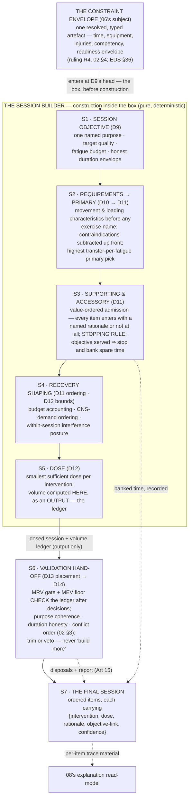

# Decision Engine V2 — The Session Builder

**Status: PROPOSAL — working doc (T4) · 2026-07-14 · not canonical; adopted only via DEVELOPMENT-PLAN §5.3**
**Sprint spec: [`docs/superpowers/specs/2026-07-14-decision-engine-v2-design.md`](../../superpowers/specs/2026-07-14-decision-engine-v2-design.md)**

---

This document specifies **session construction**: how the ratified stages
D9 → D10 → D11 → D12 — with D13 placement and D14 disposal at the week
boundary — compose into the one artefact the athlete actually experiences.
It consumes the stage contracts of
[`02-COACHING-PIPELINE.md`](02-COACHING-PIPELINE.md) verbatim (the naming
authority; stage IDs are used exactly as its §1.1 table fixes them), the
adaptation-class vocabulary that [`03-PERFORMANCE-MODEL.md`](03-PERFORMANCE-MODEL.md)
owns (Primary / Secondary / Supporting / Maintenance / Recovery), and the
resolved constraint artefact that [`06-CONSTRAINT-ENGINE.md`](06-CONSTRAINT-ENGINE.md)
specifies — referenced throughout as *the constraint envelope, 06's subject*,
never restated here. It produces two things the rest of the set builds on:
the named construction steps [`13-VALIDATION-STRATEGY.md`](13-VALIDATION-STRATEGY.md)
tests against (§0.1), and the final-session artefact shape whose per-item
fields are the material [`08-EXPLAINABILITY.md`](08-EXPLAINABILITY.md)'s
read-model renders (§7).

---

## §0 How to read this document

Four rules govern everything below.

1. **One inversion, made mechanical.** The Constitution's order is absolute:
   *"adaptation is chosen before dose; volume is a guardrail, not a goal"* —
   volume is computed as an output and checked as a ceiling, never set as a
   target to be filled (Constitution Art 6). The audit's frame-inversion
   finding is the named counter-case: at the audit pin (`main @ 02f6184`,
   2026-07-11), the weekly per-muscle volume frame was computed **before any
   session decision on every path**, derived from style/level/emphasis and
   never from the diagnosis (B2; audit 04 — classified DRIVER-frame,
   severity HIGH). The V2 builder makes the inversion impossible to express,
   not merely discouraged: **no volume quantity exists anywhere in the flow
   until step S5 computes one as an output**, and the only step that reads it
   is S6, as a check (§6). There is no earlier step a volume number could
   enter, because no earlier step has an input slot for one.
2. **The box is drawn before construction.** The builder never gathers
   constraints itself. It receives the one resolved, typed constraint
   artefact — the constraint envelope, 06's subject — at D9's head, per
   ruling R4 (02 §4): constraint resolution is Calculation over
   already-decided facts composed from D1/D6/D8 outputs (EDS §36), consumed
   by D9–D13 as an input and re-checked by D14. Every subtraction,
   admission test, and budget bound below cites that artefact; none
   re-derives it.
3. **The builder proposes; it never disposes.** Construction optimises for
   value inside the box; validation enforces safety and law after it
   (Constitution Art 19; EDS §35.3). The builder never trims its own output
   in anticipation of a validator, and never "builds more" in response to
   one — S6 is a hand-off, and what comes back is a disposal with reasons.
4. **Sketches are non-normative.** Output shapes are design artefacts; every
   output is a typed artefact carrying `{value, confidence, rationale}`
   (TAS §5.3) and contributes to the decision trace and provenance stamp
   (TAS §5.5, §5.12). Determinism is inviolable: same inputs, same session —
   no clock reads, no randomness, no I/O (Constitution Art 18).

**Two invocation contexts, one flow.** The builder runs identically on the
baseline planning pass (D1→D14) and on D15's re-entry, which re-runs D9–D14
over *pending* work only, with committed sessions frozen absolutely
(EDS D15; 02 §2.15). Readiness and other runtime signals enter only on the
D15 path, as typed inputs — the flow, the ordering, and every rule below are
the same in both contexts.

### §0.1 The construction steps (what 13 tests against)

The step names are stable identifiers for the life of the set:
`13-VALIDATION-STRATEGY.md` writes its per-step expected-behaviour tests
against this table, and §1–§7 carry one section per step.

| Step | Name | Stage home (02 §1.1, verbatim) | The question answered |
|---|---|---|---|
| **S1** | Session objective | D9 | What is today for — one purpose, one budget? |
| **S2** | Requirements → primary intervention | D10 → D11 (head) | What does that purpose require — and what single intervention drives it best? |
| **S3** | Supporting & accessory admission | D11 (value order) | What else earns a place — and when do we stop? |
| **S4** | Recovery shaping | D11 (ordering) · D12 (bounds) | In what order, at what neural cost, inside what budget? |
| **S5** | Dose | D12 | What is the smallest amount that genuinely works? |
| **S6** | Validation hand-off | D13 → D14 | Would a coach sign this — and what does the ledger say? |
| **S7** | The final session | the assembled artefact | What does the athlete receive, with which reasons attached? |

### §0.2 The flow at a glance



Read one absence as load-bearing: **no edge carries a volume quantity into
S1–S5.** Volume is born at S5 as a computed output and consumed at S6 as a
check — the diagram cannot draw the B2 inversion, and neither can the code
that implements it (Constitution Art 6).

---

## §1 S1 · Today's coaching objective (D9)

Every session begins as a purpose, not a container. S1 is D9's contract
executed verbatim (02 §2.9): exactly **one named objective** — sayable in one
sentence to the athlete — with a target quality, an intensity zone, an earned
**fatigue budget**, and an **honest duration envelope** (EDS §20 D9;
Constitution Art 7).

**Where the objective comes from.** Two inputs meet at D9's head, and only
two:

- **The weekly objective's per-day intent** (D8), which inherits the block
  objective, which traces to a D5 priority, which traces to the D4 diagnosis —
  the full trace spine, carried in the rationale (02 §2.9). The objective is
  never a template label: "Monday is chest day" is the forbidden defect
  (Ontology §7; the split-template counter-case at the pin — B8; audit 04).
- **The constraint envelope** (06's subject), entering here per ruling R4:
  today's real time window, available equipment, active contraindications,
  and the readiness envelope bound what any purpose can honestly claim
  *before* construction starts (Constitution Art 19's
  "constraints are computed before content"; 02 §4 R4).

**Why the objective must exist before anything else.** Three later mechanics
are only expressible against it (01 §8): *traceability* — every item must
trace to the objective (Constitution Art 7), and with no objective the
anti-filler rule of §3 has nothing to test against; *explanation* — "why this
session" is the first of the six answers 08's read-model renders, carried
verbatim from this step (Constitution Art 14); *sufficiency* — "smallest
sufficient" (§5) is measured against the objective, and without one the
session degrades into a container to fill.

**Degenerate cases are answered honestly, not padded over.** Two competing
purposes ⇒ split or pick one, never a muddled session (EDS D9 ✗). A fatigue
budget of zero — the week is spent — ⇒ the session is dropped or converted
to recovery intent, with the reason surfaced (Constitution Art 15; 02 §2.9).

**Output.** `SessionObjective {value, confidence, rationale}` exactly as
02 §2.9 specifies; the budget is a typed quantity S2–S4 spend against and
D14 audits.

---

## §2 S2 · Primary adaptation → primary intervention (D10 → D11)

S2 makes two moves in a fixed order, and the order is the point: the session
states **what it requires before any exercise is named**.

**Move 1 — requirements, not exercises (D10).** The objective's target
quality and its chosen adaptation — the typed Adaptation Target carried on
the D5 output per ruling R2 (02 §4), in 03's Primary class vocabulary — are
translated into movement and loading characteristics: required patterns,
force-velocity profile, contraction emphasis, sport-specific signatures — as
*requirements* (EDS §20 D10; Ontology §6, Movement Requirement — a derived
spec, not knowledge). Contraindicated patterns are **subtracted now**,
against the constraint envelope, with each subtraction citing its
artefact entry (02 §2.10) — making the D14 injury gate the backstop it was
always meant to be, not the primary defence (commitment C2, 00 §2.3;
TR-04; audit 06 · SR-03; audit 07 — immediate defects addressed by Wave A,
PRs #173/#174; the architectural position stands). If every ideal pattern is
contraindicated, the step falls to the best available transfer and records
the compromise (EDS D10 ✗; Constitution Art 15).

Requirements-first is what breaks selection-by-habit: without the stated
spec, selection is unexplainable (nothing connects the exercise to the
diagnosis), unsubstitutable (no spec for a replacement to satisfy — which
also breaks equipment fallback and injury subtraction), and unauditable
(a wrong exercise cannot even be *wrong* against anything) (01 §9;
Constitution Art 5).

**Move 2 — the primary pick (D11's head).** For the primary requirement,
select the single intervention with the highest **transfer-per-fatigue** —
transfer to the requirement per unit fatigue cost, both read from Exercise
(Intervention) Knowledge (Ontology §6: transfer value, fatigue and
joint/spinal/neural cost, equipment, competency, contraindications;
KA §4 Domain 5 — `04-KNOWLEDGE-OWNERSHIP-MAP.md` homes every magnitude,
commitment C3) — among candidates that pass the constraint envelope
*at selection*: equipment, competency, contraindication (02 §2.11). This is
the session's main quality driver, tier 1 of the value hierarchy (EDS §34),
and it is chosen by **one selection engine for every cohort** (commitment
C7): the legacy volume-first fill that served whole cohorts at the pin
(B1; audit 04 · G6; audit 08 — cohort rescue landed in Wave A, PR #173) has
no successor path here — there is no second builder to fall back to.

Sparse equipment ⇒ the best available regression along the substitution
graph, never an empty or junk-filled session (EDS D11 ✗). No candidate at
all ⇒ the requirement is surfaced as unserved with its reason, never
silently dropped (Constitution Art 15; 02 §2.11). Transfer ratings carry
knowledge confidence: disputed claims tilt ordering only, never force a
pick (Constitution Art 13; EDS §28.3).

---

## §3 S3 · Supporting interventions and accessory work (D11, value order)

Everything after the primary pick enters through one gate: **the admission
rule**. An intervention is admitted if — and only if — it presents a *named
rationale* of an admissible kind, recorded on the item itself (§7). The
admissible kinds, in the value order EDS §34 fixes (linked, not restated —
the hierarchy is the frozen owner's coaching law):

1. **Supporting the session objective** — a secondary compound or
   complementary intervention that serves *this session's* named purpose
   (EDS §34 tier 2), or discharges a **Maintenance or Recovery
   adaptation-class commitment** from the D6 strategy — 03's vocabulary: work
   holding a quality steady, or actively restorative work, committed at
   strategy level and due in this session (02 §2.6; ruling R1).
2. **Sport-specific injury prevention** — evidence-graded protocols
   (EDS §34 tier 3), typically discharging a Supporting-class commitment
   (03's subject) or a diagnosis-named robustness priority.
3. **Sport-specific accessory** — movement the sport demonstrably demands,
   citing the demand profile (EDS §34 tier 4).
4. **Targeted hypertrophy to a genuinely lagging muscle, within MRV**
   (EDS §34 tier 5) — the *only* admission a muscle may motivate, and even
   here the motivation is a diagnosed lag (a priority-relevant muscle under
   its MEV floor, read from the previous cycle's ledger), the admission is
   spare-capacity spending in value order, and the resulting sets are still
   checked by S6's ledger. A muscle quota is never the frame (Constitution
   Art 6).
5. **Core/anti-rotation, then mobility** (EDS §34 tiers 6–7) — admitted as
   spare-capacity quality work with those named rationales, never as
   default garnish.

**The anti-filler rule.** Stated as a law of the builder: **nothing enters a
session to fill time or to pay down a muscle quota.** A candidate whose only
available rationale is "there was time left in the booked hour" or "a
per-muscle target is unpaid" is *inadmissible* — those are not rationales,
they are the two signatures of the defect class this flow retires: the
deficit-pay-down fill (B1; audit 04), the volume frame that preceded every
session decision (B2; audit 04), and the fixed 3×12 iso/core filler attached
regardless of session quality (B10; audit 04 · SR-14; audit 07).
"Fill the booked time" is over-dosing's signature, forbidden by the frozen
owner in exactly those words (Constitution Art 7).

**The stopping rule.** Concrete and mechanical, applied after every
admission:

1. **Serve the objective first.** The primary requirement must be covered at
   a genuinely sufficient dose — sufficiency measured against the objective
   (Art 7's second word; under-dosing is the equal-and-opposite failure).
2. **Spend spare capacity in value order only.** While budget and duration
   remain, admit down the ordered kinds above — never sideways into filler.
3. **Stop at the first of:** the fatigue budget is spent · the honest
   duration envelope is reached · the admissible kinds are exhausted · the
   best remaining candidate's transfer-per-fatigue falls below the governed
   floor (a knowledge value with provenance — commitment C3, 04's subject).
   Then **stop and bank the spare time**: the remainder is recorded on the
   artefact as banked, and the athlete is told they are done (EDS §34 —
   "beyond the recoverable dose, time is banked, not spent"; Constitution
   Art 7).

Banked time is a first-class output, not an apology: a 40-minute session
inside a 60-minute window, with the bank stated and explained, is the
builder behaving *correctly* (Constitution Arts 7, 14).

---

## §4 S4 · Recovery constraints within the session

The builder shapes recovery at the session's own scale. Between-session
recovery — spacing, sport proximity, key-session protection — is D13's
territory and stays there (02 §2.13); *within* the session, three mechanics
apply, all knowledge-fed (KA §4 Domain 7 — Recovery, Fatigue &
Load-Response; Domain 3 — Quality & Adaptation; homes in 04):

- **Budget accounting.** The fatigue budget granted at S1 is a ledger every
  admission spends against: each intervention carries its fatigue and
  joint/spinal/neural cost from Exercise Knowledge (Ontology §6), S2 and S3
  debit it, and a spent budget is the stopping rule's first trigger. The
  accounting travels on the artefact (§7) so D14 can audit that spending
  never exceeded the grant (02 §2.9) — no fatigue is prescribed without a
  reason (Constitution Art 9).
- **CNS-demand ordering.** Within-session order descends neural demand
  while the athlete is fresh: speed/power/elastic work first, maximal
  strength next, hypertrophy and capacity work after, prevention and
  core/mobility last — *unless the objective itself dictates otherwise*
  (a contrast or potentiation purpose orders its own pairs; the objective
  wins, and D14's purpose-coherence gate checks that it did — EDS §35.1).
  The ordering is part of D11's ordered output (02 §2.11), not a cosmetic
  sort at render time.
- **Interference posture.** Stimuli the D6 strategy deliberately separated
  are not recombined inside one session (02 §2.6 — the concurrency model is
  a D6 commitment the builder honours): heavy slow eccentric work is not
  stacked immediately ahead of elastic/reactive work it would blunt;
  pairings and supersets are admitted only between non-interfering demands.
  Interference is reasoned in qualities and systems — neural, tendon,
  metabolic — not in shared muscle lists (Constitution Art 5; the
  muscles-as-interference proxy is the named counter-case — SR-13;
  audit 07).

---

## §5 S5 · Dose (D12)

Dose is where the adaptation choice becomes physical reality — and it is
assigned *last among the content decisions*, to interventions that already
exist for stated reasons (Constitution Art 6's ordering, end to end). S5 is
D12's contract executed verbatim (02 §2.12):

- **Smallest sufficient, per intervention.** For each admitted intervention,
  read the dose-response model for its target adaptation (KA §4 Domain 3)
  and assign the *smallest* dose expected to drive it, bounded by the
  remaining fatigue budget (EDS §20 D12; Constitution Art 7 — both words
  load-bearing: a single token set is not a strength stimulus, and padding
  is forbidden either way).
- **Schemes come from knowledge, keyed to quality and phase — never from a
  fixed label.** Rep/intensity/tempo/rest schemes are read per target
  quality and season phase (EDS §34, scheme models). The named counter-case
  is SR-14 (audit 07): iso/core dosing fixed at 3×12 on every path
  regardless of session quality or season, at the pin. In V2, an isometric
  or core intervention admitted into a maximal-strength session is dosed as
  what it is *in that context* (e.g. heavier, lower-rep anti-rotation with
  full rest), and the same intervention in a capacity session is dosed for
  endurance — context-aware dosing is the direct replacement for the fixed
  scheme (02 §2.12).
- **Every magnitude has a knowledge home.** No bare coefficients: every
  number read here — scheme parameters, progression increments, budget
  costs, the transfer floor — carries provenance and confidence through the
  ownership map (commitment C3; TR-12; audit 06 · SR-07; audit 07; 04's
  subject). Missing dose-response knowledge ⇒ the most conservative
  governed scheme, flagged low-confidence and surfaced — never an invented
  magnitude (KA §3.1; Constitution Art 15).
- **Readiness scales symmetrically — volume *and* intensity.** On D15's
  re-entry, the readiness envelope (constraint artefact, runtime fields)
  scales the dose in both dimensions (EDS D12; 02 §2.12); the baseline pass
  reads no clock and no readiness (Constitution Art 18).
- **The advancement decision rides along.** D12 carries progression's
  dose-advancement arm per ruling R3 (02 §4): progress / hold / deload,
  anchored to demonstrated progress, with the non-logging athlete still
  progressing on estimator-driven advancement at honest confidence
  (commitment C4; SR-01; audit 07 · G9; audit 08). The eight-level
  architecture is `07-PROGRESSION.md`'s subject; the builder only records
  the advancement decision and its driver signal on the item.

**And here — only here — volume comes into existence.** The dosed session's
per-muscle weekly volume contribution is *computed as an output* and
attached as the **volume ledger** (EDS D12 — "a ledger to check, not a
target to hit"). It is handed forward to S6 and read by nothing else. The
contrast with the pin is the whole design: there, the volume frame ran
before any session decision (B2; audit 04); here, the first step that could
even phrase a volume question is the step after the last content decision
(Constitution Art 6).

---

## §6 S6 · Validation hand-off (D13 → D14)

The builder's output is a proposal. Dosed sessions pass to D13, which places
them across the week under the envelope's spacing and sport-calendar
constraints (02 §2.13), and the placed, dosed week reaches D14 — the
signature. Writing and signing are separate acts (Constitution Art 19;
00 §1.7), and the builder honours the separation both ways: it does not
pre-trim to please validators, and it does not respond to a failure by
building more — D14's verbs are **trim or veto**, never "build more"
(EDS §20 D14).

**The volume ledger is the guardrail — checked after decisions, driving
none.** Two checks, both downstream of every content decision
(Constitution Art 6):

- **The MRV gate (ceiling).** Per-muscle actual weekly volume against MRV:
  over the ceiling ⇒ trim lowest-value sets down to it and record the trim
  (EDS §35.1, Volume sanity — Gate; Constitution Art 15). The trim is a
  disposal, recorded in the report and on the artefact — never a silent
  reduction.
- **The MEV floor (sufficiency check).** A muscle that matters to the
  diagnosis left under its minimum effective volume is flagged as
  under-stimulus in the report. The remedy runs *forward through
  construction* — a tier-5 admission candidate on the next pass (§3), or an
  honest "this program cannot serve X this week" compromise (Constitution
  Art 15) — never backward into a pre-construction volume frame. The floor
  informs the next proposal; it does not become a target the current one
  fills (Constitution Art 6; the B2 inversion, permanently closed).

Around the ledger, the full suite runs as 02 §2.14 and EDS §35.1 specify —
for this document the construction-relevant gates are worth naming:
**purpose coherence** (the session's content must match its S1 objective —
the anti-filler rule's independent audit), **duration honesty** (estimated
time from sets × rest + overhead must match the envelope the athlete was
promised), **recoverability** (the week's total spending against capacity —
the budget accounting of §4 is its input), and the equipment / competency /
contraindication gates re-checking what S2 honoured at selection (EDS §36's
shape/verify pairing). Verdict conflicts resolve in the explicit
conflict-order pass inside D14 (02 §3); genuine constraint conflicts the
envelope could not resolve surface here and are disposed under that order
(ruling R4, 02 §4).

Every trim and veto returns with its reason and tier, lands in the
validation report, and is attached to the final artefact as a compromise —
validation is a source of explanation, not just a gate (EDS §35.2;
Constitution Arts 14, 15).

---

## §7 S7 · The final session

What the athlete receives is the construction flow made visible: an ordered
list of interventions, each carrying its reasons — because sessions are how
decisions become visible, never the decision itself (Constitution Art 4).

**The artefact shape** (design sketch, non-normative — rule 4 of §0; field
semantics are the stage contracts of 02):

```
Session {
  objective:      SessionObjective,        // S1, verbatim — D9's {value, confidence, rationale}
  items: [ {
    intervention: InterventionRef,          // S2/S3 — the chosen exercise/protocol (Ontology §6)
    role:         primary | supporting | prevention | accessory | recovery,
    dose:         Dose,                     // S5 — sets × intensity × reps × tempo × rest
                                            //      + advancement {progress|hold|deload, driver}
    rationale:    string,                   // the named admission rationale (§3) + "why this,
                                            //      why this dose" — at prescription (C6)
    objectiveLink: RequirementRef,          // the requirement → objective trace (Art 7)
    confidence:   Confidence,               // transfer + dose-knowledge confidence (Art 13)
    fatigueCost:  { systemic, joint, axial, neural }   // the budget debit (§4)
  } ],                                      // ordered per §4's CNS-demand rule
  budget:        { granted, spent, banked },            // §1 grant, §4 accounting, §3 bank
  volumeLedger:  PerMuscleWeeklyContribution,           // S5 OUTPUT — read only by D14 (§6)
  compromises:   [ { what, why, tier } ],                // subtractions, unserved needs,
                                                         // trims/vetoes returned from D14 (Art 15)
  provenance:    engineVersion × knowledgeSetVersion     // TAS §5.12
}
```

**Every item answers for itself.** The per-item
`{intervention, dose, rationale, objective-link, confidence}` bundle is
deliberate: it is the unit of trace material 08's read-model renders — "why
this exercise", "why this dose", "why this order", each answered from the
decision that made it, at the moment of prescription, never reconstructed
after the fact (Constitution Art 14; commitment C6 — the pin's asymmetry,
explanation at adjustment but not at prescription, is the named gap this
shape closes: audit 03 §5).

**Consumers.** The render surface (sessions render decisions — they never
reason: TAS §3.2); 08's explanation read-model (per-item material, the
objective verbatim as answer one); 13's test harness (each step S1–S7
independently testable against its named contract); D15 (the artefact is
what re-entry projects over, pending items only, committed sessions frozen —
EDS D15); and D16 (actual-vs-prescribed per item, with the admission
rationale intact, is the learning signal that sharpens the athlete's
dose-response priors — 02 §2.16).

**The invariant, restated once at the end because it is the document's
thesis:** in this flow a session is a set of *reasons that acquired
exercises*, dosed at the smallest amount that works, checked against a
ledger it never saw while it was being built. Volume validates. It never
drives (Constitution Art 6; B2; audit 04).

---

*Next in the reading order:
[`06-CONSTRAINT-ENGINE.md`](06-CONSTRAINT-ENGINE.md) — the resolution of the
constraint envelope this builder consumes at D9's head.*
