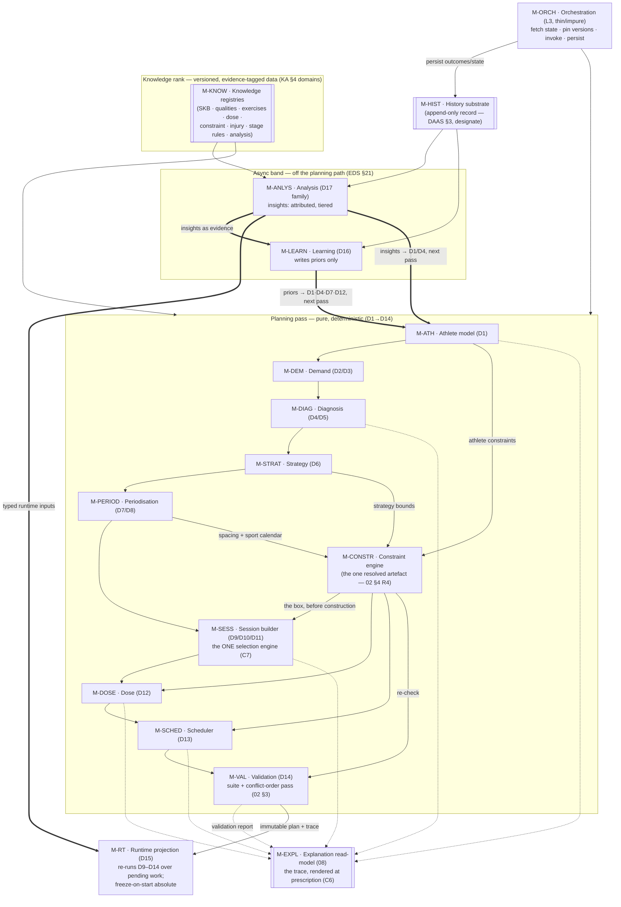
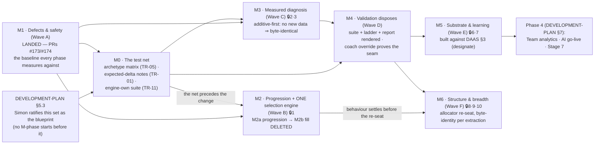

# Decision Engine V2 — Module Dependency Diagram

**Status: PROPOSAL — working doc (T4) · 2026-07-14 · not canonical; adopted only via DEVELOPMENT-PLAN §5.3**
**Sprint spec: [`docs/superpowers/specs/2026-07-14-decision-engine-v2-design.md`](../../superpowers/specs/2026-07-14-decision-engine-v2-design.md)**

---

Two diagrams close the migration set: **diagram 1** is the V2 module graph —
every node is a module from
[`10-MIGRATION-ARCHITECTURE.md`](10-MIGRATION-ARCHITECTURE.md) §2.2's table,
under the same ID, and edges are typed dependencies (who consumes whose
output); **diagram 2** is the migration dependency spine — the phases
M0–M6 of [`11-MIGRATION-PHASES.md`](11-MIGRATION-PHASES.md) with their gate
dependencies (audit 10 §4, M-numbered). Both are design artefacts,
non-normative: the ratified graph is EDS §20/§21's; the TAS layer
definitions govern; the whole-set consistency pass (Task 15) re-verifies
that diagram 1's node set and 10 §2.2's module table stay identical.

## Legend

| Mark | Meaning |
|---|---|
| `-->` solid edge | In-pass typed dependency: the consumer reads the producer's `{value, confidence, rationale}` artefact inside the same pass (TAS §5.3) |
| `-.->` dashed edge | Trace/report flow: decision trace and validation report feeding the explanation read-model (Constitution Art 14) — read-only, decides nothing |
| `==>` thick edge | Forward-only, next-pass or async flow: priors and insights enter the **next** planning pass; never backward into a committed plan (EDS §21) |
| `[[...]]` node | Substrate/read-model (knowledge, history, explanation) — consumed by decisions, owns none |
| **LANDED** | Phase executed before this set (M1 — Wave A via DEVELOPMENT-PLAN Phase 0, PRs #173/#174) |
| 🔒 n | Simon decision point (11 §8.3 ledger) gating that phase |

Module IDs (diagram 1) are 10 §2.2's; stage IDs are the ratified D1–D17
(02 §1.1); phase IDs (diagram 2) are 11 §0.1's.

## Diagram 1 — the V2 module graph

Reading notes (load-bearing, from the owners):

- **The knowledge rank feeds stages; no stage contains knowledge**
  (Constitution Art 17; C3 — M6 completes the closure).
- **The constraint envelope feeds construction**: M-CONSTR composes
  D1/D6/D8 outputs into one typed artefact consumed by D9–D13 and
  re-checked by D14 — an artefact, not a pass; no edge of the ratified
  graph is rewired (02 §4 R4; EDS §36).
- **Trace feeds explain**: M-EXPL is a projection over the decision trace
  and validation report — it renders, never reasons (TAS §5.10).
- **Next-pass edges are drawn to M-ATH** as the graph root: priors reach
  D1/D4/D7/D12 and insights reach D1/D4 as *inputs to the next planning
  pass* (02 §1.2) — the diagram routes them through the pass boundary, not
  into mid-pass stages.
- **M-HIST is consumed, never owned**: the longitudinal record is the
  DAAS's territory *(designate, in review)*; M-ORCH writes it from the
  impure layer, the async band reads it (Art 22; DAAS §3).

## Diagram 2 — the migration dependency spine (M0–M6)

Reading notes:

- **M1 is history**: it appears as the landed baseline (Wave A executed as
  DEVELOPMENT-PLAN Phase 0 Track A), not as plannable work; its residuals
  (P1-10, P1-6 🔒4, the 🔒5 flag flip) travel alongside without blocking
  any edge (11 §2).
- **The three sequencing rules** the edges encode (11 §8.1): the net
  precedes the change (M0 → M2/M3/M4); never re-seat and change behaviour
  at once (M2 → M6, with M4's suite as the independent floor under the
  re-seat); one substrate unlocks three ambitions (M5 → Phase 4's Team
  analytics, AI go-live, Stage 7 — G13/G18/G21 as one design).
- **Gates on the nodes** are 11's per-phase entry/exit gates;
  `13-VALIDATION-STRATEGY.md` attaches its per-module test obligations to
  these same phase IDs.
